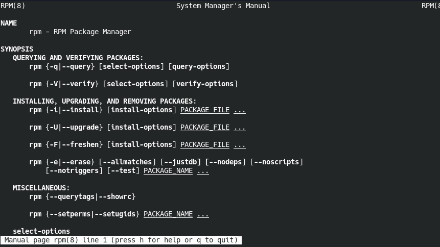
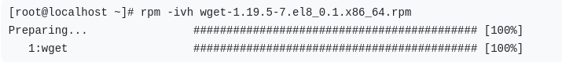
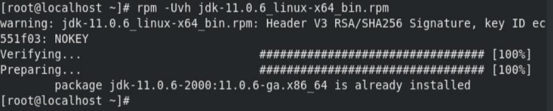
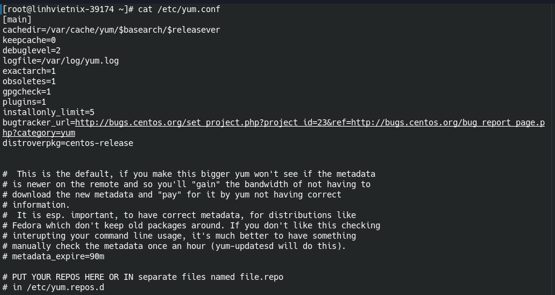
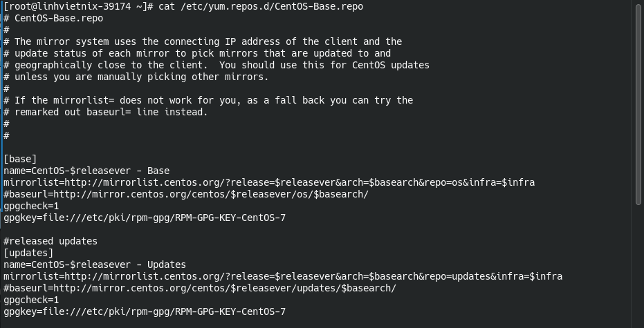
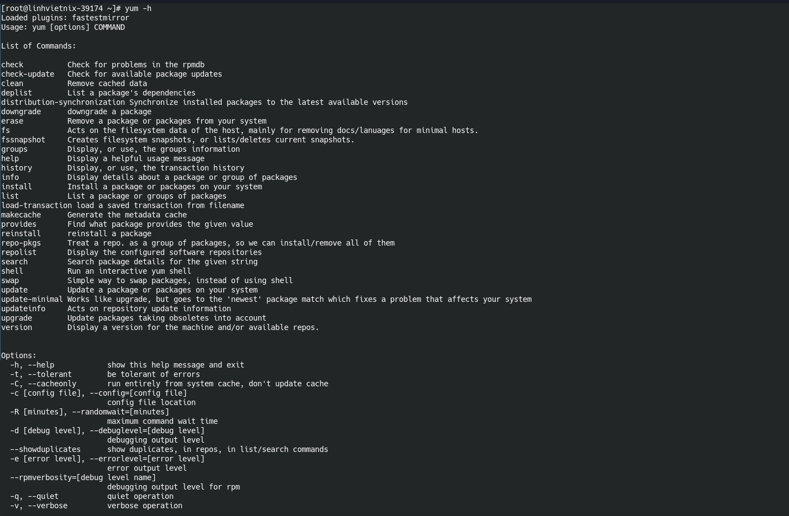

# ~* Managing Software and Processes ~* 
- Các ứng dụng và phần mềm được cài đặt trong Linux thông thường được định dạng dưới các
gói rpm (red hat package management).Các bạn có thể tìm thấy và cài đặt các gói này trong
đĩa source (cd/dvd) hoặc có thể tải về từ các trang web hỗ trợ (http://rpm.pbone.net/...).
- Cấu trúc của một gói rpm:
```
 <name>-<version>-<release>.<architecture>.rpm
 ```
 ## Quản lý gói rpm bằng dòng lệnh (rpm command)
 
 > 

 - Cài đặt môt gói rpm:
 > 
## Ý nghĩa của một số tùy chọn
```
-i (install) cài đặt một package.
-v (verbose) hiển thị tóm tắt kết quả sau khi cài đặt package.
-h (hash) hiện thị đấu “#” thông báo quá trình cài đặt đang tiếp diễn.
```
## Cập nhật 1 gói rpm 
 > 
 
 > Note: có thể dùng lệnh rpm với option:
  * --nodeps : lệnh rpm sẽ bỏ qua các gói phụ thuộc.
  * --force : lệnnh rpm sẽ bỏ qua lỗi xung đột

 ## Gỡ bỡ một gói RPM 
 Để gỡ bỏ một gói RPM chúng ta dùng :
 ```
 rpm -evh <tên gói.rpm>
 ```
 - Khi gỡ bỏ một gói phần mềm, các bạn dùng lệnh `rpm –e` có thể sẽ thấy thông báo lỗi vì có gói
phụ thuộc vào gói mà muốn xóa.Chính vì vậy để gỡ bỏ gói không cần sự kiểm tra tính phụ
thuộc,các bạn dùng tham số `--nodeps`.
- Truy vấn các gói với rpm
Các bạn có thể sử dụng tham số -qx (trong đó x là tham số thêm vào sau q) để có thể lấy thông tin của các gói:
```
-qa (all) truy vấn tất cả các package đã được cài đặt.

-qd (documentation) liệt kê các tập tin tài liệu liên quan đến package.
-qR Liệt kê các thành phần(như là các thư viện và dòng lệnh ) mà gói phụ thuộc
vào.

-ql Liệt kê các tập tin được chứa trong gói.

-qi (information) liệt kê các thông tin như package name, description, release
number, size, build date, installation date, vendor, và các thông tin khác.

-qc (configuration) liệt kê các tập tin cấu hình của package.
```
> Có thể sử dụng `grep` để tim các gói nhanh hơn


# YUM
### Xem chi tiết về YUM (Yellow Dog Updater Modified)
```
cat /etc/yum.conf
```

 > 

 ### Nguyên tắc YUM sẽ tìm kiếm các máy chủ ở thư mục /etc/yum.repos.d: 
```
cat /etc/yum.repos.d/CentOS-Base.repo 
```
 > 

 ### Cách sử dụng YUM
 ```
 yum -h 
 ```
 > 

> Các tùy chọn thường dùng với YUM
```
list : Liệt kê các gói đã cài
search : Tìm kiếm các gói liên quan
deplist :Xem các gói phụ thuộc.
info : Xem thông tin của gói.
check-upate : Tìm kiếm dữ liệu mới và so sánh.
update : Nâng cấp gói lên phiên bản mới nhất.
clean all :Xóa dữ liệu cũ mà yum đã tải về
```
# DPKG
### Cài đặt phần mềm/gói với lệnh dpkg
```
dpkg -i package_name.deb
```
### Liệt kê danh sách các gói hiện tại đã được cài đặt
```
dpkg -l search_pattern
```
Nếu muốn liệt kê tất cả các gói đã cài đặt, chỉ cần bỏ qua [search_pattern]:
```
dpkg -l 
```
### Xóa các gói đã cài đặt
```
dpkg -r package_name.deb
```

### Liệt kê nội dung của một gói
```
dpkg --contents package_name.deb
```
Cũng có thể sử dụng -c thay cho --contents.
```
dpkg -c package_name.deb
```

### Kiểm tra xem gói có được cài đặt hay không

```
dpkg -s package_name.deb
```
### Hiển thị thông tin chi tiết về một gói
```
dpkg -p package_name.deb
```
### Cài đặt nhiều gói đồng thời
```
dpkg -R --install /deb-files-location /
```


# APT-CACHE
- Công cụ apt-cache được sử dụng để tìm kiếm package đã cài đặt sẵn qua công cụ ATP. Nói một cách dễ hiểu, công cụ này được sử dụng để tìm kiếm các gói phần mềm, thu thập thông tin của các gói và tìm kiếm những gói có sẵn trên hệ thống Debian hoặc Ubuntu.


- Dưới đây là cách sử dụng lệnh apt-cache trong Ubuntu (các lệnh phụ).

### pkgnames
- Hiển thị tên của tất cả các package mà ATP có hỗ trợ, các package này không nhất thiết phải có sẵn để tải về hoặc đã cài đặt, kể cả những package ảo cũng được liệt kê.
```
apt-cache pkgnames
```
### search
- Để tìm thông tin mô tả của một package trước khi cài đặt thì ta sử dụng lệnh search.

- Sử dụng apt-cache search sẽ hiển thị danh sách các gói phù hợp và mô tả ngắn gọn của package. Giả sử bạn muốn tìm hiểu mô tả về package ‘vsftpd‘, thì lệnh sẽ là.
```
apt-cache search vsftpd
```
- Để tìm và liệt kê tất cả các package bắt đầu bằng ‘vsftpd‘, bạn có thể sử dụng lệnh sau

```
$ apt-cache pkgnames vsftpd
```
### show
- Nếu bạn muốn xem thông tin mô tả ngắn gọn của package như (version, kích thước, kích thước sau khi cài đặt, danh mục ..) thì dụng lệnh phụ show như dưới đây.
```
 apt-cache show netcat
```
### showpkg
- Sử dụng lệnh phụ ‘showpkg‘ để kiểm tra package phụ của một package, các package phụ đó đã được cài đặt hay chưa.
```

$ apt-cache showpkg vsftpd
```
### stats

- Lệnh stats dùng để thống kê tổng thể các package như: tổng số tên của package trong cache, tổng số các package ảo, ...