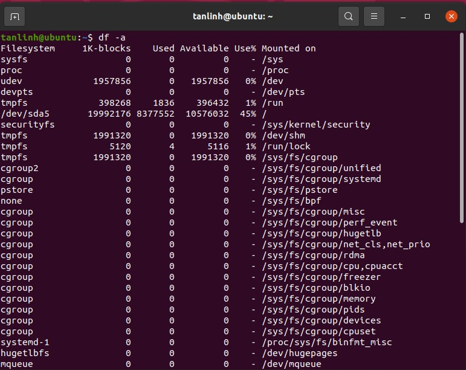
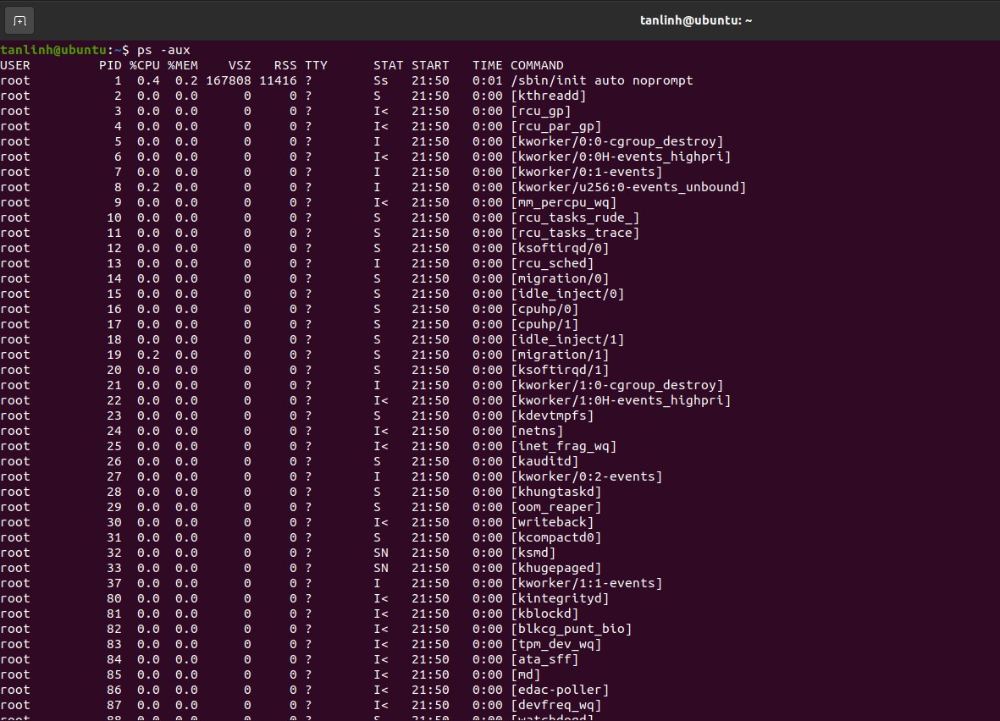
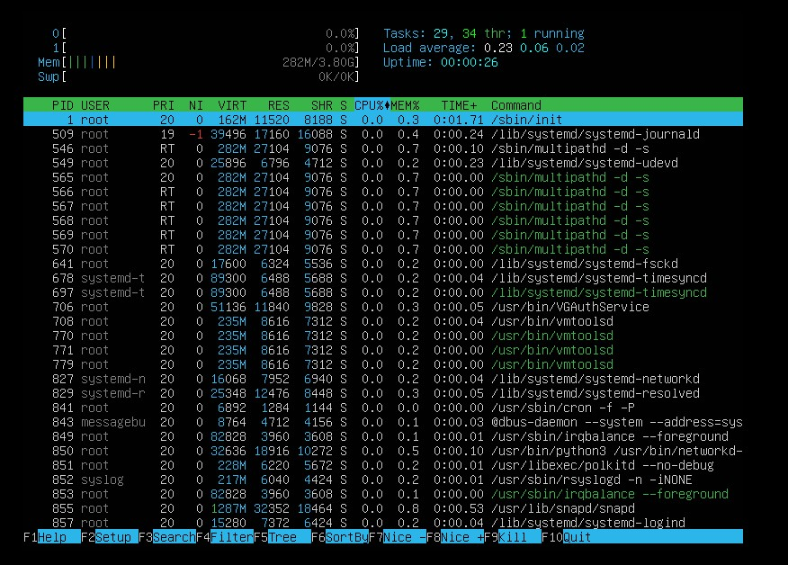
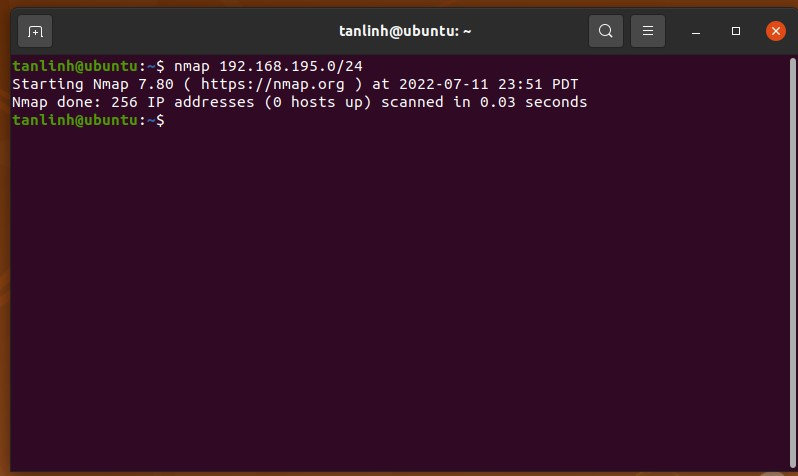
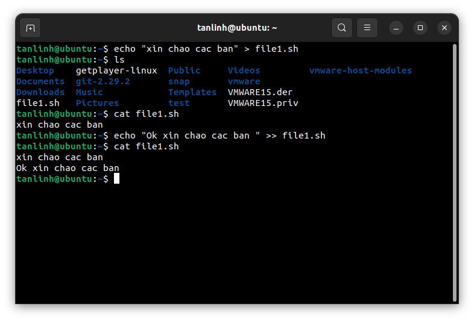
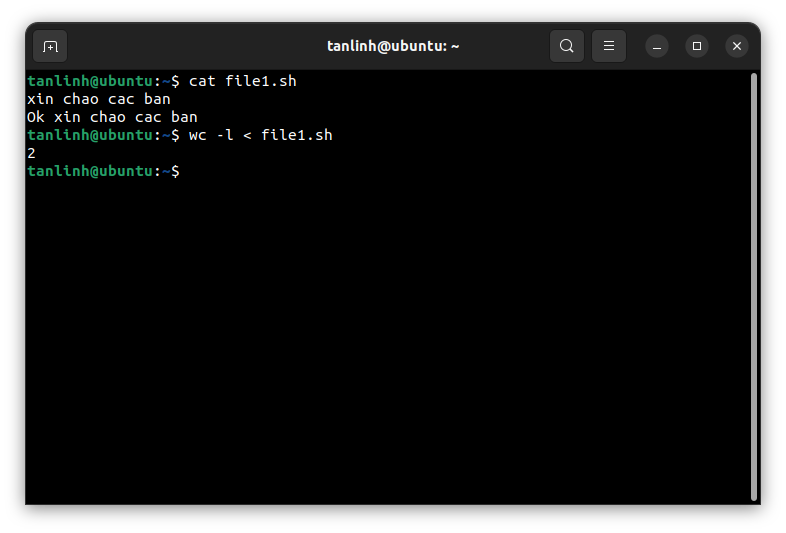

## BASE COMMAND:

# *~~ MENU FOR TASK 01 ~~*

1. <a href='#1'>Xem dung lượng disk</a>
1. <a href='#2'>Xem các phân vùng</a>
1. <a href='#3'>Check cpu, ram, network</a>
1. <a href='#4'>Theo dõi chi tiết tiến trình</a>
1. <a href='#5'>Liệt kê danh sách file/thư mục</a>
1. <a href='#6'>Tìm kiếm, copy, di chuyển,... file/thư mục</a>
1. <a href='#7'>Phân quyền cơ bản và phân quyền nâng cao</a>
1. <a href='#8'>Làm quen với trình editor vim, vi,...</a>
1. <a href='#9'> Mount/Umount</a>
1. <a href='#10'>Symbolic Links</a>
1. <a href='#11'>Hard Links</a>
1. <a href='#12'> Nén, giải nén</a>
1. <a href='#13'> Đo lượng băng thông sử dụng (traffic inbound, outbound)</a>
1. <a href='#14'>nmap, telnet, ping, ssh, copy file/thư mục từ local đến public host</a>
1. <a href='#15'>gen ssh-key</a>
1. <a href='#16'>Xem nội dung của file mà không cần dùng editor</a>
1. <a href='#17'>Đổ nội dung 1 chuỗi vào cuối file</a>
1. <a href='#18'>Basic tool review</a>
1. <a href='#19'>Understanding: Standard Input, Output, Error</a>
1. <a href='#20'>Redireacting Standard Error</a>
1. <a href='#21'>/dev/null - A place for nothing to be EXIST!</a>
1. <a href='#22'>Redirecting Standard Input!</a>

<div id='1'></div>

## 1. Xem dung lượng disk
Code:
```
df -a
```
Result:

<div id='2'></div>

## 2. Xem các phân vùng
Code:
```
fdisk -l
```
Result:


<div id ='3'></div>

## 3. Check cpu, ram, network
Code:
```
top
```
Result:


### 3.2 Check network
Code:
```
netstat && netstat -s
```

Result 01:


Result 02:


<div id='4'></div>


# 4. Theo dõi chi tiết tiến trình
Code:
```
ps -aux
```
Result:


# OR

Code:
```
htop 
```
Result:

<div id='5'></div>

# 5. Liệt kê danh sách file/thư mục
Code:
```
ls && ls -la
```
Result:


<div id='6'></div>

# 6. Find, Copy, Move, Rename
## 6.1 Find
Code:
```
locate <str_to_find> 
```
Result:


## 6.2 Copy, Xoá, Đổi tên

Code:
```
cp <src file> <des file> # copy file
mv <src file> <des locate> #di chuyển file
mv <old name> <new name> #đổi tên
rm <src file> #xoá file
```
Result:


<div id='7'></div>

# 7. Phân quyền cơ bản và phân quyền nâng cao
###  Giải thích ý nghĩa của từng chỉ số
```
-rw-r--r--     1     root   root     0 Mar  6 21:04 .autofsck
-rw-r--r--     1     root   root     0 Dec  2 11:41 .autorelabel
dr-xr-xr-x.    2     root   root  4096 Mar  6 21:06 bin
dr-xr-xr-x.    4     root   root  4096 Dec  2 11:38 boot
__________________________________________
^ ^  ^  ^      ^      ^      ^    ^      ^-- Ngày tháng tạo ra file và tên file
| |  |  |      |      |      |    |
| |  |  |      |      |      |    \--- Dung lượng của file/folder
| |  |  |      |      |      \-------- Tên group sở hữu
| |  |  |      |      \--------------- Tên user sở hữu
| |  |  |      \---------------------- Hard link, thể hiện nhiều file hoặc thư mục có cùng sử dụng chung inode
| |  |  |
| \--\--\----------------------------- Các chỉ số phân quyền
\------------------------------------- Loại file (chữ d nghĩa là thư mục)
```
Trong Linux có 3 quyền cơ bản của 1 user và group đó là:

```
r (read) – quyền đọc file/folder
w (write) – quyền ghi/sửa nội dung file/folder
x (execute) – quyền thực thi (truy cập) thư mục. Đối với thư mục thì bạn cần phải có quyền execute thì mới dùng lệnh cd để truy cập vào được
– (Deny) – Không có quyền
Các quyền này cũng có thể xác định bằng các con số tương ứng:

r (read) – được biểu diễn bằng số 4.
w (write) – được biểu diễn bằng số 2.
x (execute) – được biểu diễn bằng số 1.
– (Deny) – được biểu diễn bằng số 0
```


Code:
```
chmod a+x <file name>
chown <new user> <file to change owner>
chgrp <new gr> <file to change group owner>
```
Result:


<div id='8'></div>

# 8. Editors

Code:
```
vi || gedit || nano
```
> Giải thích:
* Với`gedit`, sử dụng như notepad
* Với `nano`,  `ctrl + s` để lưu và `ctrl + x` để thoát
* Với `vi`, nhấn `i` để thêm. `ESC` để thoát chèn , `:wq` lưu và thoát, `:q!` không lưu và thoát.

<div id='9'></div>
# 9. Mount/ Unmount

Code:
```
mount <device name> <directory>
umount <dev name>

```


<div id='10'></div>

# 10. Symbolic Links

Code:
```
ln -s <target file> <sym link>
unlink <sym link> 

```

Result:


<div id='11'></div>

# 11. Hard Links

Code:
```
ln <target file> <hard link>
unlink <hard link> # or rm to remove link

```

Result:


## Sự khác nhau giữa Hard Links và Symbolic Links 
- Các file được phân biệt định danh bằng chỉ số `inode`. Mỗi một tên file có một chỉ số `inode` đi kèm, chỉ số `inode` tham chiếu đến một vùng bộ nhớ trong đó có chứa địa chỉ vùng bộ nhớ lưu trữ dữ liệu. File là vậy các thư mục cũng được quản lý tương tự.
- Liên kết tượng trưng `symbolic link` sẽ sinh ra inode mới tham chiếu đến địa chỉ trỏ đến vùng nhớ đường dẫn của file gốc, còn liên kết cứng `hard link` thì không. Chính điều này dẫn đến việc khi xóa file nguồn đường dẫn đến file gốc sẽ bị mất, sẽ không truy cập được dữ liệu thông qua `symbolic link`, về phía `hard link` vẫn được tham chiếu đến địa chỉ và vùng nhớ lưu trữ dữ liệu. Chỉ khi nào tất cả các `hard link`, tên file tương ứng với `inode` đó bị xóa thì dữ liệu mới bị xóa.

<div id='12'></div>

# 12. Nén và giải nén

Code:

```
tar -czvf <compressed file name> <list file to compressed>
tar -xzvf <compressed file> <dir to depressed>
```

Result 01: 


Result 02:


# Lệnh nén và giải nén với file đuôi .zip
Code:

```
zip -e <file_name>.zip <list_of_files>
unzip <file_name> <destination dir>
```

<div id='13'></div>

# 13. Network Traffic Tracking

Code:

```
apt-get install vnstat
nano /etc/vnstat.conf   
systemctl enable vnstat 
systemctl start vnstat  

vnstat -d               # Xem dữ liệu hằng ngày
vnstat -l               # xem thời gian thực
```

Result sample:


<div id='14'></div>

# 14. nmap, telnet, ping, ssh, tranfer from local to public host

## 14.1 nmap

Code
```
nmap <ip/ list_ips/ network layer to scan>
```

Result 01:


Result 02:




## 14.2 telnet

Code:
```
telnet <ip> <port>
```

## 14.3 ping

Code

```
ping <ip>
```

Result 04:


## 14.4 ssh

Code
```
ssh <user>@<ip> -p <port>
```


## 14.5 Transfer using SFTP

Code:

```
sftp -P <port> <user>@<ip>
```
# 15. ssh-key
### Đầu tiên chúng ta cần connect tới máy chủ để tạo cặp `private key` và `public key`
```
ssh root@<ip của máy chủ>
vi /etc/ssh/sshd_config #chỉnh sửa file cấu hình ssh
```


> Đổi thành `PubkeyAuthentication yes`


> Đổi thành `AuthorizedKeysFile .ssh/authorized_keys` -> nơi chứa file `authorized_key`

Tạo cặp key SSH và đổi tên file `id_rsa.pub` thành `authorized_keys`
```
ssh-keygen -t rsa
cp id_rsa.pub authorized_keys 
```


```
chmod 600 /root/.ssh/authorized_keys 
chmod 700 /root/.ssh
chmod 700 /root
```


Sau đó copy file id_rsa về Desktop máy tính cá nhân
```
scp root@172.16.98.129:/root/.ssh/id_rsa ~/Desktop/
```


Tiếp theo chúng ta sẽ cấu hình file `config` từ máy cá nhân
```
vim ~/.ssh/config
Host 172.16.98.129
        User root
        Port 22
        PreferredAuthentications publickey
        IdentityFile "/home/tanlinh/Desktop/id_rsa"

```
> Giải thích : 
- Host : là địa chỉ IP máy chủ cần kết nối
- User : User từ máy chủ cần kết nối
- IdentityFile: là nơi lưu giữ file `id_rsa(Privatekey)`


> Kết quả: 


<div id='16'></div>

# 16. Xem nội dung file

Code:

```
cat <file_name> 
head <file_name> 
tail <file_name>
```

Result: 


<div id='17'></div>

# 17. Nối vào cuối tệp

Code:
```
echo <content> >> <file name>
```

Result:


<div id='18'></div>

# 18. Basic tool review

## 18.1 find

```
find <dir to find> -iname '<maybe some words here>'
```


## 18.2 grep

Code

```
grep <content_to_filter>
```

## 18.3 awk

Code:

```
awk '/xinchao/ {print NR, $0}' <file name>
```

Result: 


## 18.3 sed

This is a stream editor for filtering and transforming text.
Code:

```
sed <option here> <script here> <file input> > <result file>
#Example
sed 's/Hahaha/hihi/' tmp.txt > changed.txt
```

Result: 


## 18.4 tr
Code:

```
tr flags [SET1] [SET2]
# Example
cat file1.txt | tr [:lower:] [:upper:]
```

Result: 


## 18.5 head, tail, less, more


## 18.6 sort
Code
```
sort
```
Result: 


## 18.7 uniq 

Result: 


## 18.8 cut 

Code:

```
cut <options here> <file>

```

Result:


## 18.9 join 

Code:

```
join <options> <file1> <file2>
```

Result: 


## 18.10 diff - compare files line by line

Result:


## 18.11 xargs 


Code:
```
xargs <options> <command>
```

Result:


## 18.12 traceroute 

Code:
```
traceroute <ip> <package len>
```
Result:


## 18.13 netstat 

Code:
```
netstat <options>
```

Example Result 01:


Result 02:


## 18.14 kill, pkill


Result: 


## 18.15 wc 

Result:


## 18.16 wget 

## 18.17 git 

Code;

```
git config ...              # 
git clone <url>             # for clone resource
git add ...                 # thêm file hoặc thư mục vào repo
git commit -m "<lệnh để cam kết>"
git push                    # đẩy lên git
```

## 18.18 rsync 

Code:
```
rsync -r <src host dir> <des host dir>
```

Result:


## 18.19 tee 

Result:


<div id='19'></div>

# 19. Hiểu về : Standard Input, Output, Error

### Khái niệm:
- Ở trong hệ điều hành linux và unix các node dữ liệu đều là file, bao gồm tập tin, thư mục, các thiết bị
- Mỗi một file sẽ tương ứng với một con số gọi là File Descriptor.
- File Descriptor đặc biệt để dùng cho input và output
    + File Descriptor 0 tương ứng standard input –> dấu ” < ” hoặc dấu ” 0< ”
    + File Descriptor 1 tương ứng standard output –> dấu ” > ” hoặc dấu ” 1> ”
    + File Descriptor 2 tương ứng standard error –> dấu ” 2> ”

### Standard Output 

 

### Standard Input



### Standard Error


<div id='20'></div>

# 20. Redirecting stdout, stderr

## Redirecting stdout


## Redirecting stderr


<div id='21'></div>

# 21. /dev/null 


