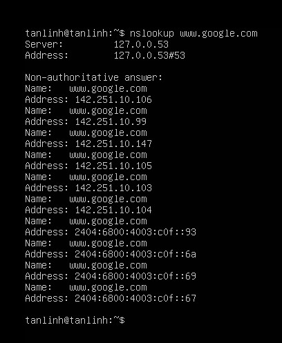

# *~~ MENU FOR TASK 02 ~~*

1. <a href='#1'>SSL và các thuật ngữ, vấn đề liên quan</a>
1. <a href='#2'>Domain là gì?</a>
1. <a href='#3'>DNS là gì? 1 số record của DNS.</a>
1. <a href='#4'>Hosting, vps, server là gì?</a>
1. <a href='#5'>Reverse proxy là gì, nguyên lý hoạt động?</a>
1. <a href='#6'>Vhost là gì? Vhost hoạt động thế nào?</a>
1. <a href='#7'>So sánh giữa Nginx và Apache?</a>

## 1. SLL và các thuật ngữ, vấn đề liên quan
- SSL là viết tắt của Secure Sockets Layer. Là một tiêu chuẩn về công nghệ bảo mật, truyền thông mã hoá. Nó sẽ tạo ra một liên kết giữa máy chủ Web và Browser( Trình duyệt). Chính liên kết này sẽ có nhiệm vụ bảo vệ toàn bộ dữ liệu từ máy chủ và trình duyệt luôn được bảo mật an toàn, riêng tư và trọn vẹn như:
    - Mã hoá các thông tin nhạy cảm trong quá trình giao dịch trực tuyến
    - Mỗi chứng chỉ SSL website được tạo ra cho một website duy nhất

*Cách thức hoạt động:* 

1. Trình duyệt kết nối với server bằng HTTPS (SSL) khi TCP được thiết lập

1. Máy chủ gửi chứng chỉ SSL/TLS 

1. Trình duyệt web sẽ kiểm tra chứng chỉ, các CA tin cậy và chắc chắn rằng chứng chỉ SSL chưa hết hạn. Nếu đạt yêu cầu, trình duyệt web sẽ tạo và mã hoá dữ liệu rồi gửi lại bằng khoá chung cho máy chủ. Phiên mã hoá bắt đầu.

1. Máy chủ nhận mã hoá, giải mã khoá bằng khóa riêng và gửi lại xác nhận để bắt đầu mã hoá.

1. Trình duyệt và máy chủ hiện mã hoá các dữ liệu bằng khoá phiên.

## Các thuật ngữ của chứng chỉ SSL thường gặp
- DV SSL(Domain Validation)
    - Là chứng chỉ xác thực tên miền, dành cho các khách hàng cá nhân với mã hoá cơ bản
- OV SSL(Organization Validation)
    - Là chứng chỉ xác thực tổ chức, dành cho các tổ chức hay doanh nghiệp có độ tin cậy cao
- EV SSL(Extended Validation)
    - Là chứng chỉ xác thực mở rộng, là chứng chỉ có độ xác thực cao nhất và chỉ dành cho các doanh nghiệp, tổ chức còn đang hoạt động và phải tuân thủ nghiêm ngặt các quy định từ CA-Browser Forum 
- SANs SSL(Subject Alternative Names)
    - Là chứng chỉ dành riêng cho các ứng dụng Communication của Microsoft 
- Wildcard SSL(Wildcard SSL Certificate)
    - Là chứng chỉ cung cấp cho các website có như cầu sử dụng chứng chỉ SSL cho các subdomain(tiên miền phụ) khác nhau(có thể sử dụng không giới hạn cho các tên miền phụ)

## 2. Domain là gì 
- Domain là địa chỉ trang web hoạt động trên internet, Domain được thể hiện bằng các ký tự hoặc chữ số trong bảng chữ cái thay cho địa chỉ IP của máy chủ
 - Domain Name gồm 2 phần :
    * Tên trang web. VD: vietnix
    * Phần mở rộng. VD: .vn
- Việc đăng ký tên miền được cấp phép bởi tổ chức ICANN - quản lý tất cả các domain name quốc tên trên thế giới
## Cấu trúc của một tên miền
- Tên miền bao gồm nhiều thành phần cấu tạo nên thường được phân cách nhau bởi dấu `(.)`. Tối thiếu có 2 phần:
    - Tên miền cao cấp nhất `(TLD - Top Level Domain)` VD: .vn
    - Tên miền cao cấp 2 `(SLD - Second Level Domain)` VD: vietnix

Result: 

## 3. DNS là gì? 1 số bản ghi của DNS.
## 3.1 DNS là gì?
-  DNS là viết tắt của cụm từ `Domain Name System` (hệ thống phân giải tên miền). DNS là một hệ thống cho phép thiết lập tương ứng giữa địa chỉ `IP` và `Domain`(tên miền).
## 3.2 Các loại bản ghi của DNS
- CNAME Record(Bản ghi CNAME)
- A Record
- MX Record
- AAAA Record
- SRV Record
- NS Record
- PTR Record

## 4. Hosting, VPS, Server là gì

## 4.1 Hosting là gì ?
-  Hosting được hiểu đơn giản là nơi lưu trữ nội dung của website, dịch vụ mail, FTP, ... Nếu không có hosting thì trang web chỉ có thể hoạt động trên máy tính cá nhân `(local host)`.Với web hosting thì bất cứ ai cũng có thể truy cập website nếu có `domain`(tên miền) hoặc địa chỉ `IP` chính xác.
- Các loại hosting:
    - Shared Hosting (Hosting dùng chung)
    - Dedicated Server Hosting (Lưu trữ máy chủ vật lý)
    - VPS Hosting – Virtual Private Server Hosting (Lưu trữ máy chủ ảo riêng)
    - Cloud Server Hosting (Lưu trữ máy chủ đám mây)
    - Managed hosting ( dịch vụ lưu trữ chuyên dụng)
    - Managed hosting

## 4.2 Virtual Private Server (VPS)
- `VPS (Virtual Private Server)` là dạng máy chủ ảo được tạo ra bằng phương pháp phân chia một máy chủ vật lý thành nhiều máy chủ khác nhau có tính năng tương tự như máy chủ riêng `VDS (Virtual Dedicated Server)`, chạy dưới dạng chia sẻ tài nguyên từ máy chủ vật lý ban đầu đó. Mỗi VPS là một hệ thống hoàn toàn riêng biệt, có một phần CPU riêng, dung lượng RAM riêng, dung lượng ổ HDD riêng, địa chỉ IP riêng và hệ điều hành riêng, người dùng có toàn quyền quản lý root và có thể restart lại hệ thống bất cứ lúc nào.
 ## 4.3 Server là gì ?
 - Máy chủ (Server) là một máy tính được kết nối với mạng máy tính hoặc Internet, có IP tĩnh, có năng lực xử lý cao. Trên đó người ta cài đặt các phần mềm để phục vụ cho các máy tính khác truy cập để yêu cầu cung cấp các dịch vụ và tài nguyên.

 

 
 ## 5. Reverse proxy là gì, nguyên lý hoạt động?
 - Reverse proxy là một loại proxy server trung gian giữa một máy chủ và các client gửi tới các yêu cầu. Nó kiểm soát yêu cầu của các client, nếu hợp lệ, sẽ luân chuyển đến các server thích ứng. Trái ngược với `forward proxy`, là một trung gian cho phép các client liên hệ với nó liên lạc với bất kỳ máy chủ ảo nào, `reverse proxy` là một trung gian cho các máy chủ liên hệ với nó được liên lạc bởi bất kỳ client nào. Ưu điểm lớn nhất của việc sử dụng reverse proxy là khả năng quản lý tập trung. Nó giúp kiếm soát mọi request do client gửi lên các server được bảo vệ.
 ## Nguyên lý hoạt động của Reverse proxy
1. Request của `USER` đến `Reverse Proxy`
1. Request của `USER` được `Reverse Proxy` chuyển đến `Webserver`
1. Webserver trả về reponse cho `Reverse Proxy`, cache được lưu lại ở `Reverse Proxy`
1. `Reverse Proxy` trả reponse cho `USER`
1. Request của `USER` lần thứ 2 đến `Reverse Proxy`
1. Request của `USER` lần thứ 2 được `Reverse Proxy` xử lý, nếu request yêu cầu có sẵn trong cache thì trả lại cho `USER`, nếu chưa có thì quay lại Bước 2, và tương tự như vậy đến lần thứ n.

 

## 6. Vhost là gì? Vhost hoạt động thế nào?
- `Virtual Host` là một dạng lưu trữ mà ta có thể lưu được nhiều domain khác nhau trên cùng một máy chủ sever. Hiện nay Virtual được xem là một giải pháp tiết kiệm chi phí vì nó cho phép nhúng nhiều domain trên một địa chỉ IP trong một Sever. Server sẽ tự động hiểu tên miền nào đang vận hành bên trong vị trí lưu trữ Server tùy theo cách cài đặt.
### Cách thức vận hành của Virtual Host
* Có nhiều cách khác nhau để xác định cấu hình của một Virtual Host, nhưng cách được sử dụng thông dụng ngày nay là:
    * IP Based : Xác định website thông qua địa chỉ IP
    * Port – Based : Xác định website thông qua địa chỉ port 
    * Name Based : Xác định địa chỉ website thông qua tên - `Domain name`

 

## 7. So sánh giữa Nginx và Apache?
## Nginx 
`Nginx` là một máy chủ mã nguồn mở nổi tiếng. Khi mới ra đời, Nginx được dùng để phục vụ web HTTP. Tuy nhiên, hiện nay nó được dùng để làm Reverse Proxy, Email Proxy (IMAP, POP3, SMTP) và và một trình cân bằng tải (load balancer) và proxy ngược (reverse proxy) cho các máy chủ HTTP, TCP và UDP.
## Apache

## So sánh giữa Nginx và Apache
### Hiệu suất
1. Đối với nội dung tĩnh

- NGINX  nhanh hơn khoảng 2,5 lần so với Apache dựa trên kết quả của một thử nghiệm benchmark chạy lên đến 1.000 kết nối đồng thời.

- Ở một bechmark khác với 512 kết nối đồng thời, cho thấy NGINX là nhanh hơn khoảng hai lần và tiêu thụ ít bộ nhớ một chút (4%).

- Vậy NGINX phục vụ nội dung tĩnh nhanh hơn nhiều so với Apache.

2. Đối với nội dung động

- Cả NGINX và Apache đều bằng nhau
### Bảo mật 
Cả Apache và NGINX đều rất coi trọng tính bảo mật trên trang web của mình. Cả hai máy chủ này đều định kỳ phát hành báo cáo bảo mật và những tư vấn, đảm bảo rằng khía cạnh bảo mật được tăng cường ở mọi cấp độ
### Hệ điều hành hỗ trợ
- Apache hoạt động trên tất cả các loại hệ thống Unix-like (Linux hoặc BSD) và hỗ trợ đầy đủ cho Microsoft Windows.

- Nginx cũng chạy trên một vài hệ thống trong số chúng và cũng hỗ trợ Window tuy nhiên hiệu suất không được mạnh bằng.
### Hỗ trợ & Tài liệu
- Apache sở hữu mạng lưới hỗ trợ cộng đồng lớn thông qua mailing lists, IRC và Stack Overflow. Ngoài ra, còn có tùy chọn hỗ trợ bên thứ ba từ OpenLogic.

- Tương tự, Nginx cũng có hỗ trợ thông qua mailing lists, IRC và Stack Overflow. Nginx còn có một sản phẩm có tên Nginx + có hỗ trợ riêng của Google bao gồm nhiều tính năng hơn.

- Cả Nginx và Apache đều cung cấp tài liệu, bao gồm hầu hết mọi chủ đề và tính năng cần thiết. Tài liệu này bao gồm release notes, user guides, tutorials... Nginx thậm chí có wiki riêng!

### Tính linh hoạt
- Một máy chủ web phải đủ linh hoạt để cho phép các tùy chỉnh. Apache làm điều đó khá tốt, thông qua việc sử dụng các công cụ .htaccess mà Nginx không hỗ trợ. Nó cho phép phân cấp nhiệm vụ admin. Admin bên thứ ba và admin cấp hai có thể bị ngăn truy cập vào máy chủ chính. Hơn nữa, Apache hỗ trợ hơn 60 mô-đun, giúp nó có khả năng mở rộng cao. Đó là lý do tại sao Apache phổ biến hơn với các nhà cung cấp dịch vụ hosting chia sẻ