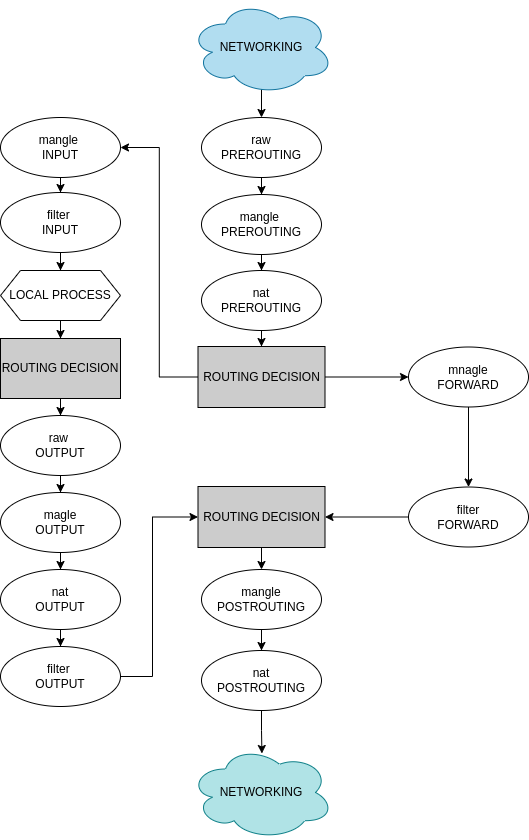
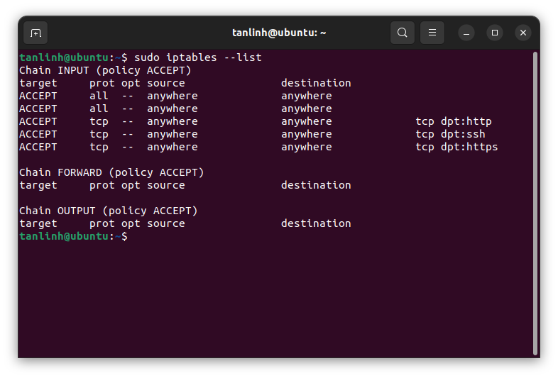
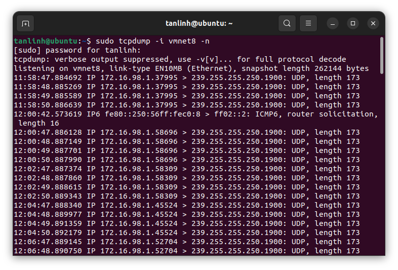
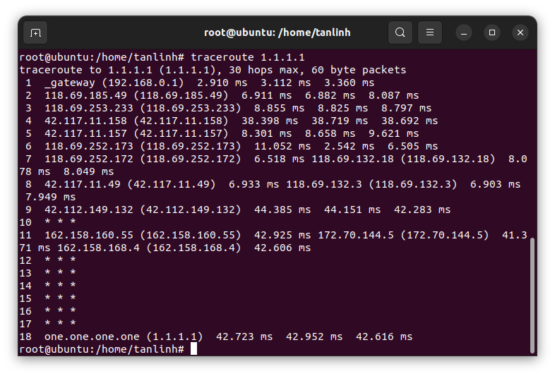

# *~~ MENU FOR TASK 03 ~~*

1. <a href='#1'>Iptables packet flow diagram</a>
1. <a href='#2'>TRACKING some packets</a>
1. <a href='#3'>IPTABLES Rules</a>
1. <a href='#4'>TCPDUMP details</a>
1. <a href='#5'>DNS resolve</a>

<div id='1'></div>

# 1. Iptables packet flow diagram

### Iptables là gì ?
- IPtables là một chương trình Firewall(tường lửa). Chương trình này được phát triển chủ yếu cho hệ điều hành Linux, cho phép thiết lập các quy tắc riêng để kiểm soát truy cập và tính năng bảo mật cho hệ thống.
- Về cơ bản, `IPtables` chỉ là giao diện dòng lệnh để tương tác với `packet filtering` của `netfilter framework`. Cơ chế `packet filtering` của `IPtables` hoạt động gồm 3 thành phần là `Tables`, `Chains` và `Targets`.
### Mô hình iptables packet flow diagram

> Giải thích:
* Các talbe iptables
    * `filter` : là một trong những tables được `IPtables` sử dụng nhiều nhất, nó quyết định việc một gói tin có được đi đến đích dự kiến hay từ chối yêu cầu của gói tin
    * `nat`: để dùng các rules về NAT(Network Address Translation), NAT Tables có nhiệm vụ chỉnh sửa source (IP nguồn) hoặc destination(IP đích của gói tin khi thực hiện cơ chế NAT)
    * `mangle`: cho phép chỉnh sửa header của gói tin, giá trị của các trường TTL, MTU, Type of Service.
    * `raw`: được sử dụng để theo dõi trạng thái kết nối 
    * `security`: có nhiệm vụ đánh dấu những gói tin có liên quan đến context của SELinux, nó giúp cho SELinux hiểu được context SELinux và xử lý gói tin.
* Các chain iptables 
    * `prerouting` chain này quyết định điều gì sẽ xảy ra với một packet ngay khi nó tới Network Interface
    * `input` là một trong những chain phổ biến vì nó hầu như luôn chứa các rule nghiêm ngặt để kiểm soát truy cập từ internet gây hại cho máy tính
    * `forward` chain này chịu trách nhiệm fordward packet
    * `output` chịu trách nhiệm cho tất cả quá trình truy cập ra bên ngoài 
    * `postrouting` chain này là nơi các packet để lại dấu vết cuối cùng trước khi rời khỏi máy tính

Lệnh để hiển thị tất cả các `chain` trong `table`:
```
iptables -L -t <table_name>
```
Lệnh để hiển thị tất cả các chuỗi `filter` trong bảng mặc định :
```
iptables --list
```


### Đường đi của gói tin trong 3 kịch bản
1. Gói tin có destination là IP server thì đi như thế nào.
```
Packets/Network >  PREROUTING/nat > Routing decision > INPUT/filter > Local process
```
> Giải thích : `packet`/network khi được gửi đến máy chủ. Chuỗi đầu tiên là `PREROUTING` của `nat` sẽ bắt lấy nó, sau đó `destination ip address` sẽ chuyển các gói tin thành các gói tin phù hợp với `local server`, sau đó `routing decision` sec quyết định các gói tin có thuộc về máy chủ hay không. Vì vậy, gói tin sữ được lọc theo `INPUT/filter`.
2. Gói tin từ server đi ra như thế nào.
```
Local process > Routing decision > OUTPUT/nat > OUTPUT/filter > Routing decision > POSROUTING/nat > Packets/Network
```
> Giải thích: Dữ liệu từ `local process` sẽ được quyết định bởi `routing decision` chúng sẽ được gửi đến `network` hoặc `other local process`. Nếu `network` thì sẽ đến với `OUTPUT/nat` các gói sẽ được tạo cục bộ trên tường lửa. Sau đó, các gói tin sẽ được gửi đến `OUTPUT/filter` để đảm bảo các gói tin đó có được phép gửi đi hay không. `Routing decision` một lần nữa sẽ quyết định nếu gói tin đó là `localhost` hoặc `other IPs`, nếu nó là một IP khác , `server` sẽ được gửi đến `POSROUTING/nat`. Điều này giúp `source ip adress` chuyển thành một thứ gì đó phù hợp với `routing` trên máy chủ đích.

3. Gói tin có destination là IP không phải của server, thì server xử lý như nào.
```
Packets/Network > PREROUTING/nat > Routing decision > FORWARD/filter > Routing decision > POSTROUTING/nat > Network
```
> Giải thích: Cũng giống như trường hợp `#1. Gói tin có destination là IP server ` nhưng nếu `Routing decision` nhận ra rằng các gói tin đó không thuộc về máy chủ thì nó sẽ được gửi đến `FORWARD/filter`. Nếu `FORWARD chain` nhận biết được đâu là đích đến của gói tin thì nó sẽ gửi đến `other Routing decistion`, nếu không `FORWARD/filter` sẽ DROP nó
<div id='2'></div>

### 2. Demo sử dụng module TRACE để theo dõi gói tin trong hai kịch bản:
### 2.1 Theo dõi gói SYN, từ IP công ty đến máy ảo lab, đi như thế nào.

```
tcpdump -i vmnet8 -n
# OR for only SYN/ACK packets
tcpdump -nn -i vmnet8 "tcp[tcpflags] & (tcp-syn|tcp-ack) != 0"
```



### 2.2 Theo dõi gói icmp từ máy ảo ping đi 1.1.1.1 đi như thế nào.
```
tcpdump -i vmnet8 -n icmp
```


```
traceroute 1.1.1.1
```

<div id='3'></div>

### 3. IPtables rules căn bản

* Cho phép/Chặn IPX truy cập đến IP dest A.B.C.D port YYY

    ```
    iptables -A INPUT -p tcp -s <src IP> --destination-port <port number> -j DROP
    iptables -A INPUT -p tcp -s <src IP> --destination-port <port number> -j ACCEPT
    ```
* Cho phép/chặn tất cả ip mới truy cập đến IP dest A.B.C.D port YYY
    ```
    iptables -A INPUT -p tcp --destination-port <port number> -j DROP
    iptables -A INPUT -p tcp --destination-port <port number> -j ACCEPT
    ```
* Cho phép/Chặn ip Y.J.K.F truy cập đến IP dest A.B.C.D port YYY với TTL 128,64 và Length 1000
    ```
    iptables -A OUTPUT -m ttl --ttl-gt 128,64 -m length --length 1000 -s <block ip> --dport <port number> -j DROP
    iptables -A OUTPUT -m ttl --ttl-gt 128,64 -m length --length 1000 -s <block ip> --dport <port number> -j ACCEPT
    ```
* Đặt comment cho 1 iptables rules bất kỳ.
    ```
    iptables -A INPUT --dport 22 -j ACCEPT -m comment --comment "allow ssh"
    ```
<div id='4'></div>

### 4. Tìm hiểu về công cụ tcpdump, những options có thể dùng để debug network.
- TCPDUMP là công cụ được phát triển nhằm mục đích nhận diện và phân tích các gói dữ liệu mạng theo dòng lệnh. TCPDUMP cho phép khách hàng chặn và hiển thị các gói tin được truyền đi hoặc được nhận trên một mạng có sự tham gia của máy tính.
    ### Các options có thể dùng để  debug network.

```
# tcpdump sẽ liệt kê ra tất cả các interface đang hiện hữu trên máy tính mà nó có thể capture được.
tcpdump -D

# Muốn chụp các gói tin trên một interface được chỉ định.
tcpdump -i eth0         # OR tcpdump --interface any

# tcpdump sẽ dừng hoạt động sau khi capture N gói tin.
tcpdump -c <N>

# tcpdump sẽ không phân giải từ địa chỉ IP sang hostname và portname
tcpdump -nn

# Hiển thị các packet được capture dưới dạng mã ACSII.
tcpdump -A

# Filter ICMP
tcpdump icmp

# Lọc HOST
tcpdump host <IP host>

# Lọc Port
tcpdump port 80

# Lọc nguồn và đích
tcpdump src <ip> dst <ip>

# Lọc ip và port
tcpdump -i any -c5 -nn src <IP> and port <port>     
# hoặc :
tcpdump -i any -c5 -nn "port <port> and (src <ip> or src <ip>)"

# tcpdump sẽ capture các packet và lưu xuống file chỉ định
tcpdump -w <file name>.pcap

```

