# *~~ MENU FOR TASK 04 ~~*

### Trên mỗi mô hình, thao tác xây dựng 2 web với 2 domain (hint: sử dụng vhost)
* Domain: wordpress.training.vn - dựng wordpress
* Domain: laravel.training.vn - dựng laravel

1. <a href='#1'>LAMP stack :  build wordpress webiste trên chính mô hình trên</a>
1. <a href='#2'>LEMP stack : build wordpress webiste trên chính mô hình trên</a>
1. <a href='#3'>Thao tác trên máy ảo, thử trỏ /etc/hosts từ máy thật về máy ảo xem domain có hoạt động ổn định không.</a>

<div id='1'></div>

### 1. Build mô hình trên LAMP stack
Mô hình lab: 

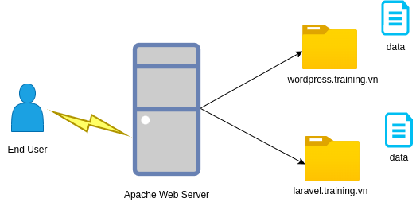

> Trên server sẽ cấu hình chạy 2 web site là:

1. wordpress.training.vn – đường dẫn: /var/www/wordpress.training
1. laravel.training.vn – đường dẫn: /var/www/laravel.training


Code:
```
rpm --import /etc/pki/rpm-gpg/RPM-GPG-KEY*
yum -y install epel-release
```
> Giải thích : Cung cấp các khả năng cài đặt cho các gói về sau

#### Cài đặt MySQL/ MariaDB
Code:
```
yum -y install mariadb-server mariadb
```
và cho database khởi động cùng hệ thống 
```
systemctl start mariadb.service
systemctl enable mariadb.service
```
Đặt password cho tài khoản root:
```
mysql_secure_installation
```
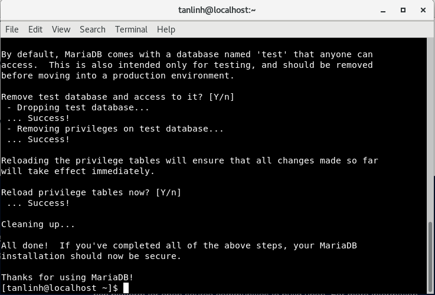

#### Cài đặt Apache2
Code :
```
yum -y install httpd
```
và khởi động Apache:
```
systemctl start httpd.service
systemctl enable httpd.service
```
Cấu hình cho firewall:
```
firewall-cmd --permanent --zone=public --add-service=http
firewall-cmd --permanent --zone=public --add-service=https
firewall-cmd --reload
```
> Kết quả: 

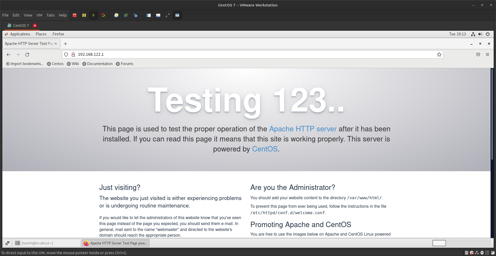

#### Caì đặt PHP 
Code:

```
yum -y install http://rpms.remirepo.net/enterprise/remi-release-7.rpm
yum -y install epel-release yum-utils
```
Tắt repo PHP 5.4 và khởi động PHP 7.3

```
yum-config-manager --disable remi-php54
yum-config-manager --enable remi-php73
```
Cài đặt thêm các gói :
```
sudo yum -y install php php-cli php-fpm php-mysqlnd php-zip php-devel php-gd php-mcrypt php-mbstring php-curl php-xml php-pear php-bcmath php-json
````
và kiểm tra version

```
php -v
```
> Kết quả:
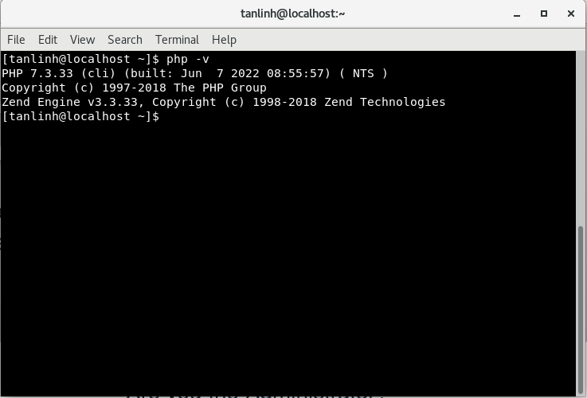

Khởi động lại service httpd:
```
systemctl restart httpd
```
Kiểm tra thông tin phiên bản PHP đã cài đặt:
```
vi /var/www/html/info.php
<?php
phpinfo();
?>
```
> Kết quả:
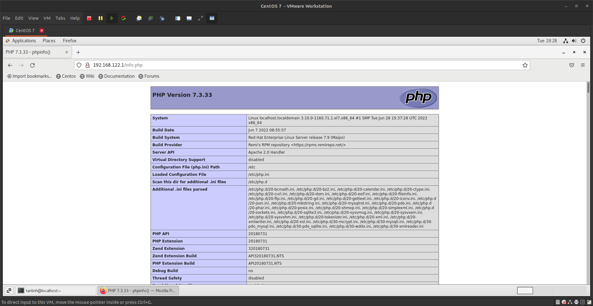

#### Cài đặt phpMyadmin
Code:
```
yum install phpMyAdmin
```
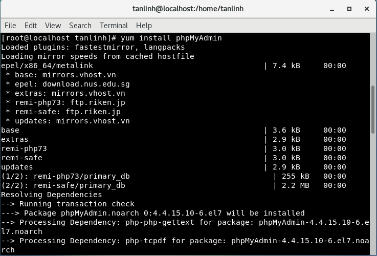

và chỉnh sửa cấu hình file `conf`
```
vi /etc/httpd/conf.d/phpMyAdmin.conf

[...]
Alias /phpMyAdmin /usr/share/phpMyAdmin
Alias /phpmyadmin /usr/share/phpMyAdmin

#<Directory /usr/share/phpMyAdmin/>;

# <IfModule mod_authz_core.c>
# # Apache 2.4
# <RequireAny>
# Require ip 127.0.0.1
# Require ip ::1
# </RequireAny>
# </IfModule>
# <IfModule !mod_authz_core.c>
# # Apache 2.2
# Order Deny,Allow
# Deny from All
# Allow from 127.0.0.1
# Allow from ::1
# </IfModule>
#</Directory>
```
và thêm :
```
<Directory /usr/share/phpMyAdmin/>
Options none
AllowOverride Limit
Require all granted
</Directory>
[...]
```
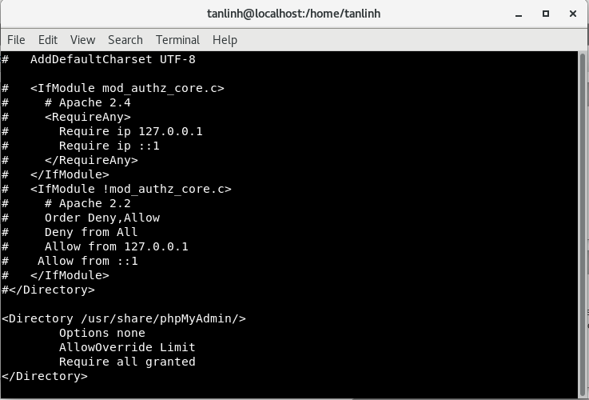

Khởi động lại apache2:
```
systemctl restart  httpd
```
> Kết quả:
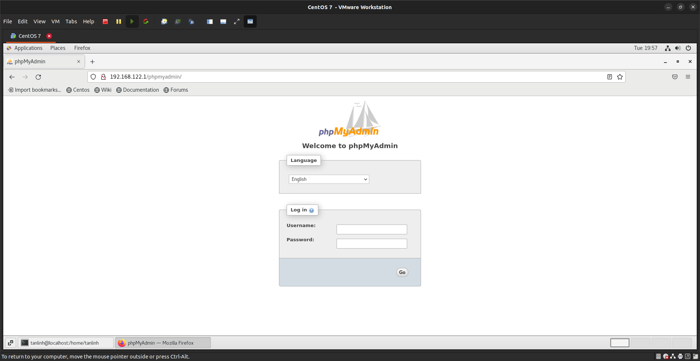

Đăng nhập bằng tài khoản `root` và `password` đã tạo trước đó và tạo 1 `database` trùng tên với `user`
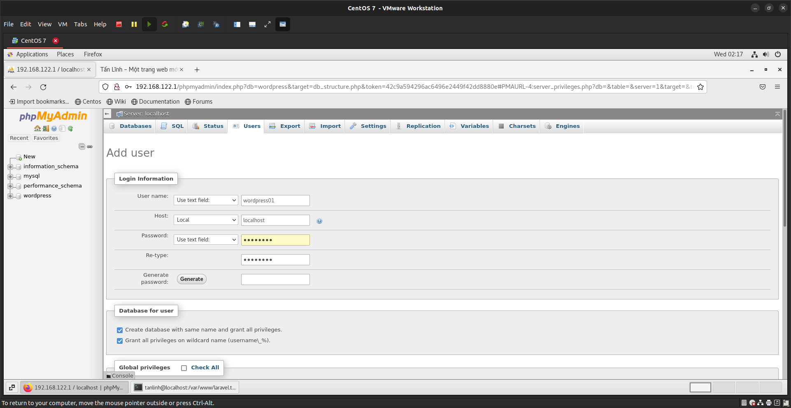


### Cấu hình Virtual Host 
Tạo 2 Folder chứa code cho 2 website là `wordpress.training` và `laravel.training`
code: 
```
sudo mkdir -p /var/www/wordpress.training
sudo mkdir -p /var/www/laravel.training
```
Chỉnh sửa quyền truy cập sao cho quyền đọc được chấp nhận với tất cả các file và thư mục bên trong /var/www

```
sudo chmod -R 755 /var/www
```
Tạo ra file index.html đơn giản cho 2 website để kiểm thử hoạt động của Virtual host.
```
touch /var/www/wordpress.training/index.html

touch /var/www/laravel.training/index.html

echo "<center><h1>This is website web1.com</h1></center>" > /var/www/wordpress.training/index.html

echo "<center><h1>This is website web2.com</h1></center>" > /var/www/laravel.training/index.html
```
Tạo 2 thư mục lưu trữ File cấu hình Virtual host cho apache:
```
sudo mkdir /etc/httpd/sites-available
sudo mkdir /etc/httpd/sites-enabled
```

Cấu hình cho Apache nhận cấu hình những virtual host trong `sites-enabled`
```
sudo nano /etc/httpd/conf/httpd.conf
```
Thêm dòng sau vào cuối file:

```
IncludeOptional sites-enabled/*.conf
```
Lưu lại và thoát

### Tạo File Virtual host cho wordpress.training.vn:
```
sudo nano /etc/httpd/sites-available/wordpress.training.vn.conf
```
Thêm nội dung sau vào file:

```
<VirtualHost *:80>
       ServerAdmin tanlinh15@gmail.com
       ServerName wordpress.training.vn
       ServerAlias www.wordpress.training.vn
       DocumentRoot /var/www/wordpress.training
       DirectoryIndex index.php index.html
       ErrorLog /var/www/wordpress.training/error.log
       CustomLog /var/www/wordpress.training/requests.log combined
</VirtualHost>
```
Lưu lại và thoát
> Giải thích:
* `ServerAdmin` khai báo email của quản trị viên.
* `ServerName` khai báo domain mà website sẽ lắng nghe.
* `ServerAlias`  (tuỳ chọn) khai báo Alias của domain, thương là www.
* `DirectoryIndex` loại file sẽ được tìm đến để khởi chạy.
* `DocumentRoot` khai báo đường dẫn chứa code của website.
* `ErrorLog` và `CustomLog` khai báo đường dẫn lưu file log của website.

### Kích hoạt Virtual host
```
sudo ln -s /etc/httpd/sites-available/worpress.training.vn.conf /etc/httpd/sites-enabled/worpress.training.vn.conf
sudo ln -s /etc/httpd/sites-available/laravel.training.vn.conf /etc/httpd/sites-enabled/laravel.training.vn.conf
```
> Giải thích: Apache sẽ chỉ nhận những cấu hình Virtual host trong thư mục sites-enabled. vì vậy ta sẽ tạo một liên kết ( symbolic link) vào thư mục `sites-enabled`

Restart Apache để lưu thay đổi.
```
sudo apachectl restart
```
### Cài đặt Wordpress cho website `wordpress.training.vn`

code:
```
sudo yum install php-gd 
sudo service httpd restart
cd ~
yum install wget
wget http://wordpress.org/latest.tar.gz
```
sau đó giải nén 
```
tar -xzvf latest.tar.gz
```
và copy folder `wordpress` bỏ vào folder `wordpess.training` đã tạo trước đó 
```
cp -r ~/wordpress/* /var/www/html/
```
tạo file upload cho folder
```
mkdir /var/www/wordpress.training/wp-content/uploads
sudo chown -R apache:apache /var/www/wordpress.training/*
```
### Cấu hình cho Wordpress
```
cd /var/www/wordpress.training
```
Copy file cấu hình database và chỉnh sửa
```
cp wp-config-sample.php wp-config.php
vi wp-config.php
```
nhập các thông tin như `username`, `password`
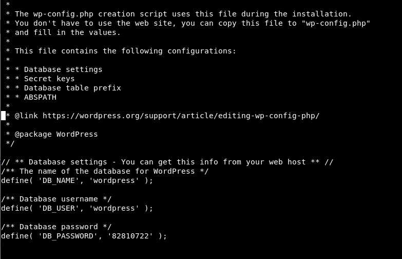

Lưu lại và thoát.
> kết quả:

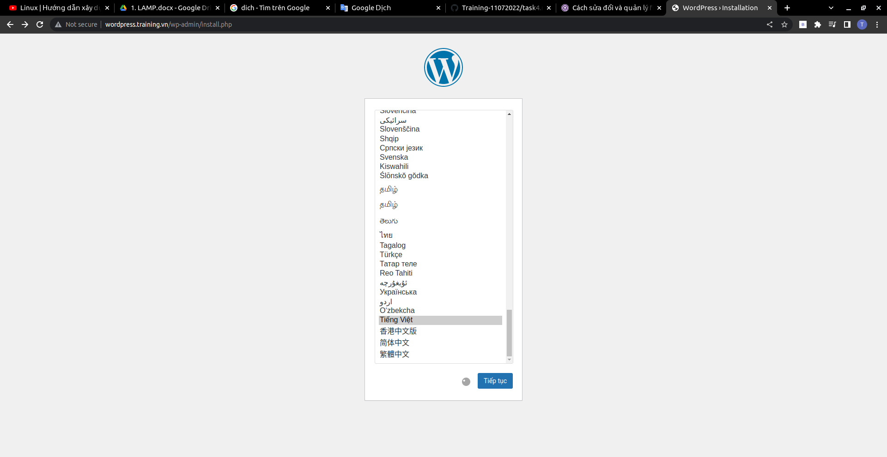

Thiết lập cấu hình wordpress và nhận kết quả :
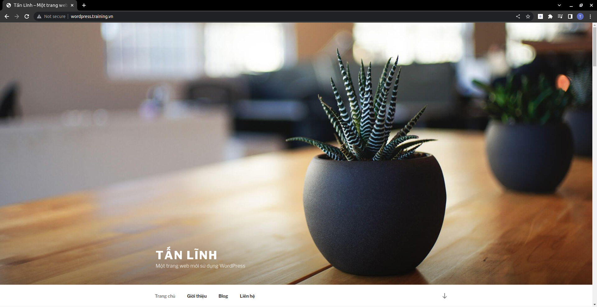

### Cài đặt Laravel cho web laravel.training.vn

Tương tự với web `wordpress.training.vn` ta thiết lập `*conf` cho nó
```
sudo nano /etc/httpd/sites-available/laravel.training.vn.conf

<VirtualHost *:80>
        ServerName laravel.training.vn
        DocumentRoot /var/www/laravel.training/public
       <Directory /var/www/laravel.training/public>
          <IfModule mod_rewrite.c>
          Options -MultiViews
          RewriteEngine On
          RewriteCond %{REQUEST_FILENAME} !-f
         RewriteRule ^ index.php [L]
       </IfModule>
</Directory>
</VirtualHost>

```
#### Cài đặt composer 
```
curl -sS https://getcomposer.org/installer | sudo php -- --install-dir=/usr/bin --filename=composer
```
#### Cài đặt Laravel
Di chuyển đến thư mục website `laravel.training` đã tạo trước đó và cài đặt Laravel
```
cd /var/www/laravel.training
composer create-project laravel/laravel
```
Sau đó chúng ta sẽ `mv` toàn bộ file trong folder `laravel` ra ngoài folder `laravel.training`

```
cd /var/www/laravel.training
mv laravel/{.,}* /var/wwww/laravel.training/
rm -rf laravel
sudo chown -R apache:apache /var/www/laravel.training/*
```
Tiến hành restart lại server 
```
systemctl restart httpd
```
> Kết quả:


# Buid mô hình trên LEMP stack
## Mô hình Lab


* Trên server sẽ cấu hình chạy 2 web site là:

     *  wordpress.training.vn – đường dẫn: /var/www/wordpress.training
     *  laravel.training.vn – đường dẫn: /var/www/laravel.training

## Cài đặt Nginx Web Server
Đầu tiên cần cài các gói cần thiết:
```
yum install yum-utils -y
```
Cài đặt Nginx
```
yum install nginx -y
```
Khởi động nginx
```
systemctl enable nginx
systemctl start nginx
```
Kiểm tra trạng thái của `Nginx`
```
systemctl status nginx
```
Cấu hình Firewalld (Nếu có)
```
firewall-cmd --permanent --zone=public --add-service=http
firewall-cmd --permanent --zone=public --add-service=https
firewall-cmd --reload
```
kiểm tra kết quả :

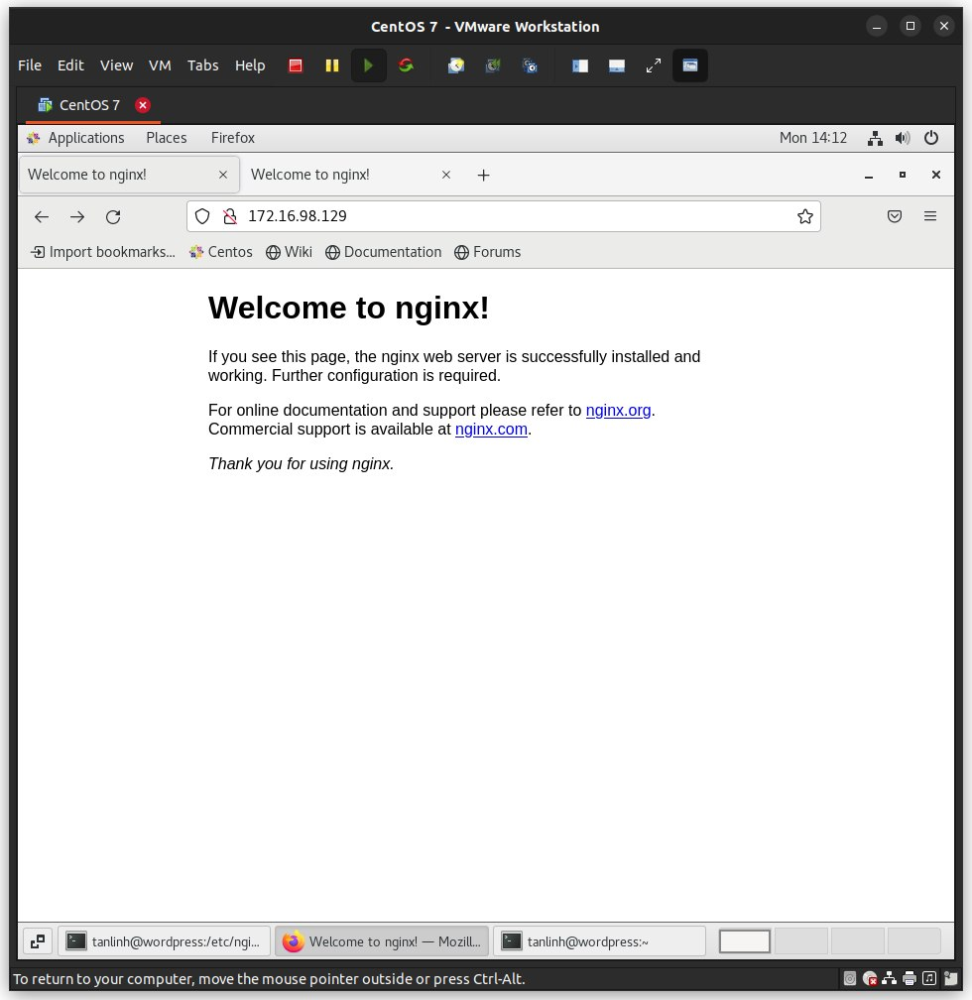
## Cài đặt PHP
```
yum --enablerepo=remi,remi-php71 install -y nginx php-fpm php-common
yum --enablerepo=remi,remi-php56 install -y php-opcache php-pecl-apcu php-cli php-pear php-pdo php-mysqlnd php-pgsql php-pecl-mongo php-pecl-sqlite php-pecl-memcache php-pecl-memcached php-gd php-mbstring php-mcrypt php-xml
```
Khởi động `PHP-FPM` 
```
systemctl enable php-fpm.service
```
cấu hình file `*.conf`cho `Nginx` 
```
nano /etc/nginx/conf.d/default.conf
server {
    listen       80 default_server;
    server_name localhost;

    location / {
        root   /usr/share/nginx/html;
        index index.php index.html index.htm;
        try_files $uri $uri/ /index.php?q=$uri&$args;
    }

    error_page  404              /404.html;
    location = /404.html {
        root   /usr/share/nginx/html;
    }

    error_page   500 502 503 504  /50x.html;
    location = /50x.html {
        root   /usr/share/nginx/html;
    }

    # pass the PHP scripts to FastCGI server listening on 127.0.0.1:9000
    #
    location ~ \.php$ {
        root           /usr/share/nginx/html;
        fastcgi_pass   127.0.0.1:9000;
        fastcgi_index  index.php;
        fastcgi_param  SCRIPT_FILENAME   $document_root$fastcgi_script_name;
        include        fastcgi_params;
    }
}
```
Sau đó chúng ta khởi động lại `Nginx`
```
systemctl restart nginx.service
```

Cấu hình PHP-FPM
```
nano /etc/php-fpm.d/www.conf
```
Thay user và group = apache sang nginx
```
[...]
 ; Unix user/group of processes
 ; Note: The user is mandatory. If the group is not set, the default user's group
 ; will be used.
 ; RPM: apache Choosed to be able to access some dir as httpd
 user = nginx
 ; RPM: Keep a group allowed to write in log dir.
 group = nginx
 [...]
 ```
 Restart PHP-FPM

 ```
 systemctl restart php-fpm.service
 ```
#### Test cấu hình Nginx và PHP-FPM
```
vi /usr/share/nginx/html/info.php
```
thêm đoạn sau vào 
```
<?php
phpinfo();
?>
```
kết quả :

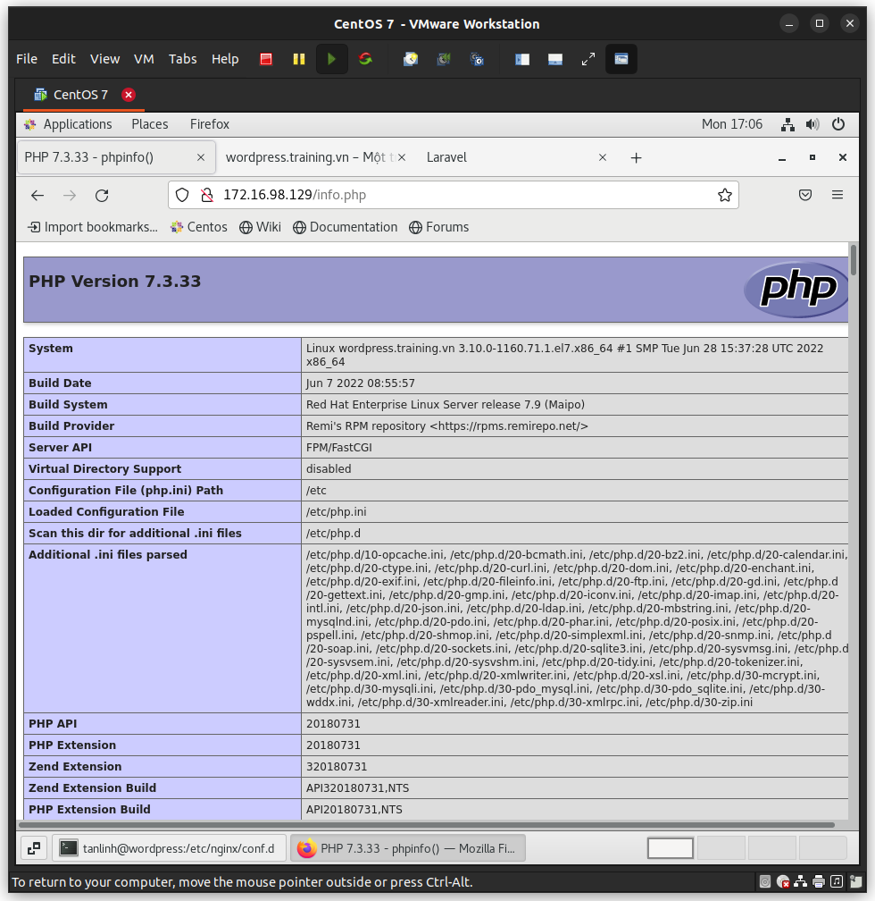
## Cài đặt MariaDB
```
yum install -y mariadb mariadb-server
```
Khởi động MariaDB và tự động chạy khi boot
```
systemctl start mariadb.service
systemctl enable mariadb.service
```
### Cấu hình mariadb
```
/usr/bin/mysql_secure_installation
```
Ngay bước đầu tiên bạn sẽ bị hỏi root password, do mới cài đặt nên tất nhiên chưa có password, nhấn Enter để tiếp tục.

Output tương tự như sau:
```
NOTE: RUNNING ALL PARTS OF THIS SCRIPT IS RECOMMENDED FOR ALL MariaDB
SERVERS IN PRODUCTION USE! PLEASE READ EACH STEP CAREFULLY!

In order to log into MariaDB to secure it, we\'ll need the current
password for the root user. If you\'ve just installed MariaDB, and
you haven\'t set the root password yet, the password will be blank,
so you should just press enter here.

Enter current password for root (enter for none):
OK, successfully used password, moving on...

Setting the root password ensures that nobody can log into the MariaDB
root user without the proper authorisation.

Set root password? [Y/n] y
New password:
Re-enter new password:
Password updated successfully!
Reloading privilege tables..
... Success!


By default, a MariaDB installation has an anonymous user, allowing anyone
to log into MariaDB without having to have a user account created for
them. This is intended only for testing, and to make the installation
go a bit smoother. You should remove them before moving into a
production environment.

Remove anonymous users? [Y/n] y
... Success!

Normally, root should only be allowed to connect from \'localhost\'. This
ensures that someone cannot guess at the root password from the network.

Disallow root login remotely? [Y/n] y
... Success!

By default, MariaDB comes with a database named \'test\' that anyone can
access. This is also intended only for testing, and should be removed
before moving into a production environment.

Remove test database and access to it? [Y/n] y
- Dropping test database...
... Success!
- Removing privileges on test database...
... Success!

Reloading the privilege tables will ensure that all changes made so far
will take effect immediately.

Reload privilege tables now? [Y/n] y
... Success!

Cleaning up...

All done! If you\'ve completed all of the above steps, your MariaDB
installation should now be secure.

Thanks for using MariaDB!
```
Như vậy là đã cài đặt thành công MariaDb
##  Tạo Virtual host (vhost)
- Chúng ta sẽ tạo ra 2 website là `wordpress.training.vn` và `laravel.training.vn`
```
mkdir -p /var/www/wordpress.training
mkdir -p /var/www/laravel.training
```
và tạo ra 2 file `*.conf`
```
touch /etc/nginx/conf.d/wordpress.training.conf

```
và
```

vi /etc/nginx/conf.d/laravel.training.conf

server {
    listen       80;
    server_name  laravel.training.vn;

    #charset koi8-r;

    #access_log  logs/host.access.log  main;

    location / {
        root   /var/www/laravel.training/public;
        index index.php  index.html index.htm;
    }

    error_page  404              /404.html;
    location = /404.html {
        root   /usr/share/nginx/html;
    }

    # redirect server error pages to the static page /50x.html
    #
    error_page   500 502 503 504  /50x.html;
    location = /50x.html {
        root   /usr/share/nginx/html;
    }

    # proxy the PHP scripts to Apache listening on 127.0.0.1:80
    #
    #location ~ \.php$ {
    #    proxy_pass   http://127.0.0.1;
    #}

    # pass the PHP scripts to FastCGI server listening on 127.0.0.1:9000
    #
    location ~ \.php$ {
        root           /var/www/laravel.training/public;
        fastcgi_pass   127.0.0.1:9000;
        fastcgi_index  index.php;
        fastcgi_param  SCRIPT_FILENAME  $document_root$fastcgi_script_name;
        include        fastcgi_params;
    }

    # deny access to .htaccess files, if Apache's document root
    # concurs with nginx's one
    #
    #location ~ /\.ht {
    #    deny  all;
    #}
}

```
## Cài wordpress cho `wordpress.training.vn`
* Download WordPress
    * Ta có thể download Wordpress trực tiếp từ trang web của họ:
```
wget http://wordpress.org/latest.tar.gz
```
Lệnh này sẽ tải gói wordpress đã nén về thẳng folder chính của user 
```
tar -xzvf latest.tar.gz 
```
#### Tạo Database và User WordPress
```
mysql -u root -p
```
Đăng nhập bằng password root MySQL , sau đó ta cần tạo database wordpress, một user trong database đó và cấp cho user đó một password mới. Lưu ý tất cả các lệnh MySQL phải kết thúc bằng dấu chấm phẩy.
Đầu tiên, hãy tạo database
```
CREATE DATABASE wordpress;
Query OK, 1 row affected (0.00 sec)
```
Sau đó, ta cần tạo user mới. :
```
CREATE USER wordpressuser@localhost;
Query OK, 0 rows affected (0.00 sec)
```
Đặt password cho user mới của bạn:
```
SET PASSWORD FOR wordpressuser@localhost= PASSWORD("password");
Query OK, 0 rows affected (0.00 sec)
```
Kết thúc bằng cách cấp tất cả các quyền cho user mới. Nếu không có lệnh này, trình cài đặt wordpress sẽ không thể khởi động:
```
GRANT ALL PRIVILEGES ON wordpress.* TO wordpressuser@localhost IDENTIFIED BY 'password';
Query OK, 0 rows affected (0.00 sec)
```
Sau đó làm mới MySQL:
```
FLUSH PRIVILEGES;
Query OK, 0 rows affected (0.00 sec)
```
Thoát ra khỏi MySQL shell:
```
exit
```
### Cài đặt cấu hình wordpress
Bước đầu tiên là sao chép file cấu hình WordPress mẫu, nằm trong folder WordPress, vào một file mới mà ta sẽ chỉnh sửa, tạo một cấu hình WordPress có thể sử dụng mới:
```
cp ~/wordpress/wp-config-sample.php ~/wordpress/wp-config.php
```
Sau đó mở cấu hình wordpress:
```
sudo nano ~/wordpress/wp-config.php
```
Tìm phần chứa trường bên dưới và thay thế bằng tên chính xác cho database , tên user và password của bạn:
```
// ** MySQL settings - You can get this info from your web host ** //
/** The name of the database for WordPress */
define('DB_NAME', 'wordpress');

/** MySQL database username */
define('DB_USER', 'wordpressuser');

/** MySQL database password */
define('DB_PASSWORD', 'password');
```
Lưu và thoát.

### Sao chép file

Cần tạo folder nơi ta sẽ giữ các file `wordpress`:

```
sudo mkdir -p /var/www/wordpress
```
Chuyển các file WordPress đã extract vào folder của trang web
```
sudo cp -r ~/wordpress/* /var/www/wordpress.training
```

Cấp quyền sở hữu folder cho user nginx, thay thế "tên user " bằng tên của user server của bạn.

```
cd /var/www/
sudo chown nginx:nginx * -R
sudo usermod -a -G nginx username
```
### Cài đặt file `*.conf` cho web `wordpress.training.vn`

```
sudo vi /etc/nginx/conf.d/wordpress.training.conf

server {
    listen       80;
    server_name  wordpress.training.vn;

    #charset koi8-r;

    #access_log  logs/host.access.log  main;

    location / {
        root   /var/www/wordpress.training;
        index index.php  index.html index.htm;
    }

    error_page  404              /404.html;
    location = /404.html {
        root   /usr/share/nginx/html;
    }

    # redirect server error pages to the static page /50x.html
    #
    error_page   500 502 503 504  /50x.html;
    location = /50x.html {
        root   /usr/share/nginx/html;
    }

    # proxy the PHP scripts to Apache listening on 127.0.0.1:80
    #
    #location ~ \.php$ {
    #    proxy_pass   http://127.0.0.1;
    #}

    # pass the PHP scripts to FastCGI server listening on 127.0.0.1:9000
    #
    location ~ \.php$ {
        root           /var/www/wordpress.training;
        fastcgi_pass   127.0.0.1:9000;
        fastcgi_index  index.php;
        fastcgi_param  SCRIPT_FILENAME  $document_root$fastcgi_script_name;
        include        fastcgi_params;
    }

    # deny access to .htaccess files, if Apache's document root
    # concurs with nginx's one
    #
    #location ~ /\.ht {
    #    deny  all;
    #}
}
```
Lưu, thoát và khởi động lại nginx để các thay đổi có hiệu lực:
```
sudo service nginx restart
```
### Truy cập Cài đặt WordPress

> Kết quả: 
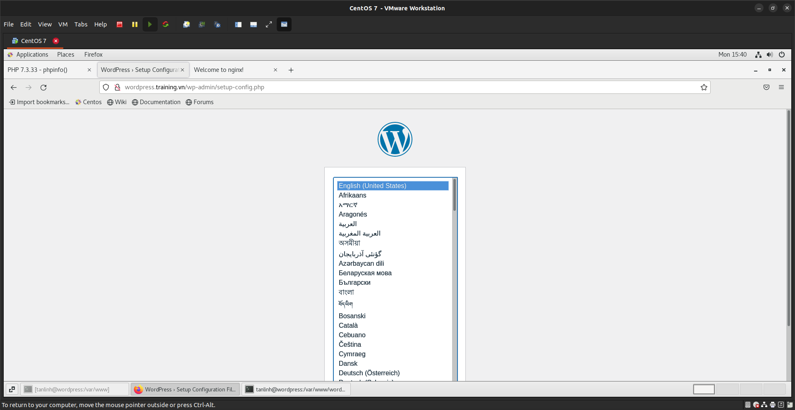

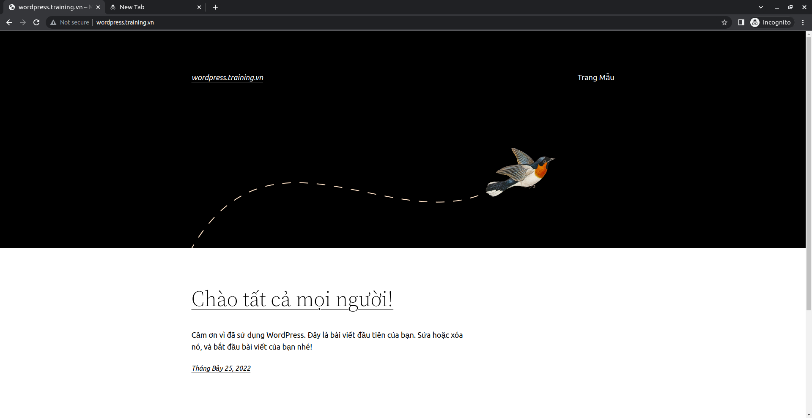

## Cài đặt Laravel cho 'laravel.training.vn`
### Cài đặt composer
```
curl -sS https://getcomposer.org/installer | sudo php -- --install-dir=/usr/bin --filename=composer
```
### Cài đặt Laravel
Tương tự với web `wordpress.training.vn` ta thiết lập *conf cho nó
```
sudo vi /etc/nginx/conf.d/laravel.training.vn.conf

#
# The default server
#
server {
    listen       80;
    server_name  laravel.training.vn;

    #charset koi8-r;

    #access_log  logs/host.access.log  main;

    location / {
        root   /var/www/laravel.training/public;
        index index.php  index.html index.htm;
    }

    error_page  404              /404.html;
    location = /404.html {
        root   /usr/share/nginx/html;
    }

    # redirect server error pages to the static page /50x.html
    #
    error_page   500 502 503 504  /50x.html;
    location = /50x.html {
        root   /usr/share/nginx/html;
    }

    # proxy the PHP scripts to Apache listening on 127.0.0.1:80
    #
    #location ~ \.php$ {
    #    proxy_pass   http://127.0.0.1;
    #}

    # pass the PHP scripts to FastCGI server listening on 127.0.0.1:9000
    #
    location ~ \.php$ {
        root           /var/www/laravel.training/public;
        fastcgi_pass   127.0.0.1:9000;
        fastcgi_index  index.php;
        fastcgi_param  SCRIPT_FILENAME  $document_root$fastcgi_script_name;
        include        fastcgi_params;
    }

    # deny access to .htaccess files, if Apache's document root
    # concurs with nginx's one
    #
    #location ~ /\.ht {
    #    deny  all;
    #}
}
```
Di chuyển đến thư mục website `laravel.training` đã tạo trước đó và cài đặt Laravel
```
cd /var/www/laravel.training
composer create-project laravel/laravel
```
Sau đó chúng ta sẽ mv toàn bộ file trong folder laravel ra ngoài folder laravel.training
```
cd /var/www/laravel.training
mv laravel/{.,}* /var/wwww/laravel.training/
rm -rf laravel
sudo chown -R nginx:nginx /var/www/laravel.training/*
```
Tiến hành restart lại server
```
systemctl restart httpd
```
> Kết quả:
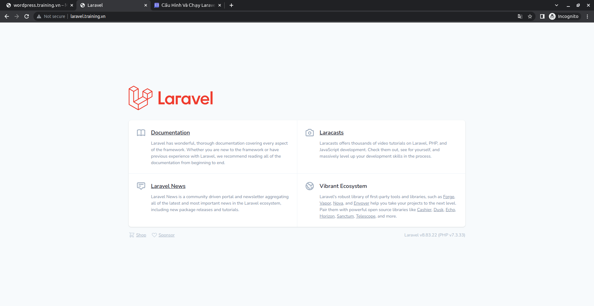
<div id='3'></div>

# 3. Thao tác trên máy ảo, thử trỏ /etc/hosts từ máy thật về máy ảo xem domain có hoạt động ổn định không.
Đầu tiên chúng ta cần chỉnh sửa file hosts:
```
vi /etc/hosts
```
chèn thêm 2 dòng :
```
<your-ip> wordpress.training.vn
<your-ip> laravel.training.vn
```
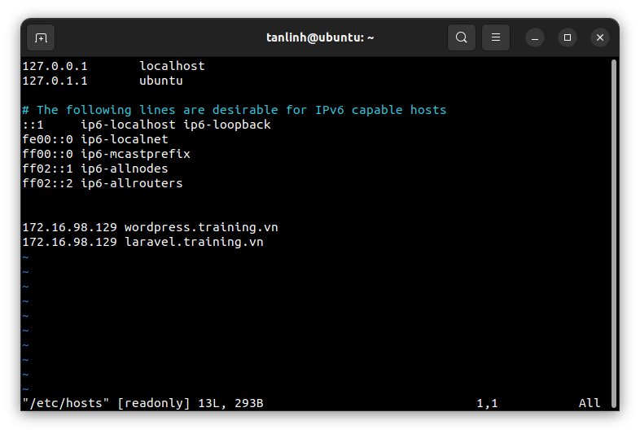

> Kết quả:
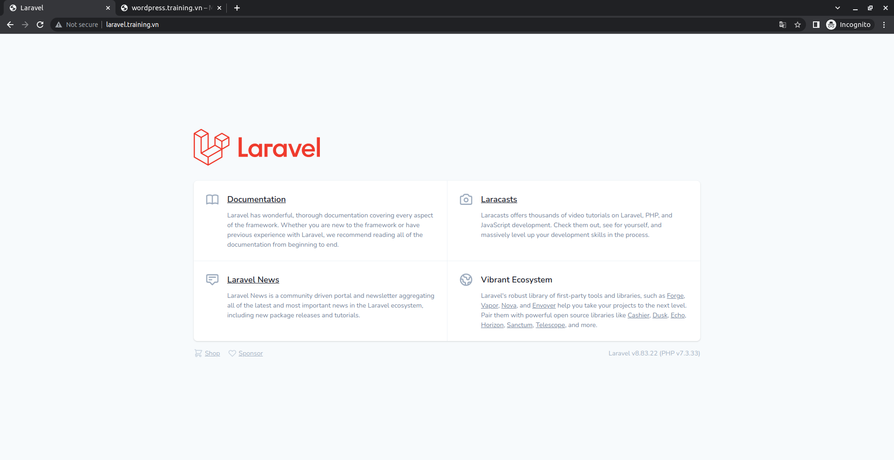
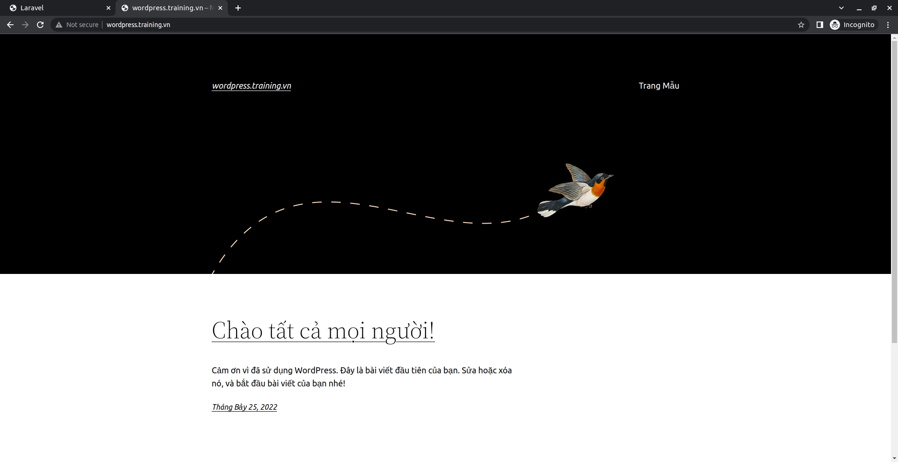
