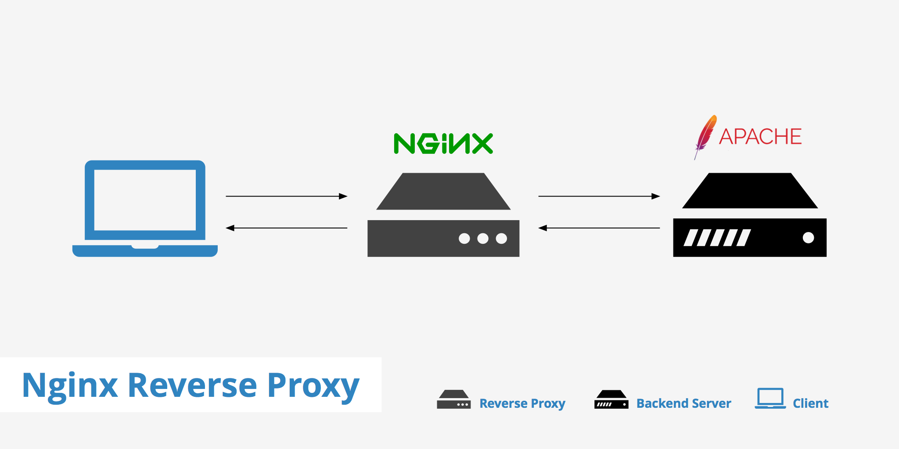
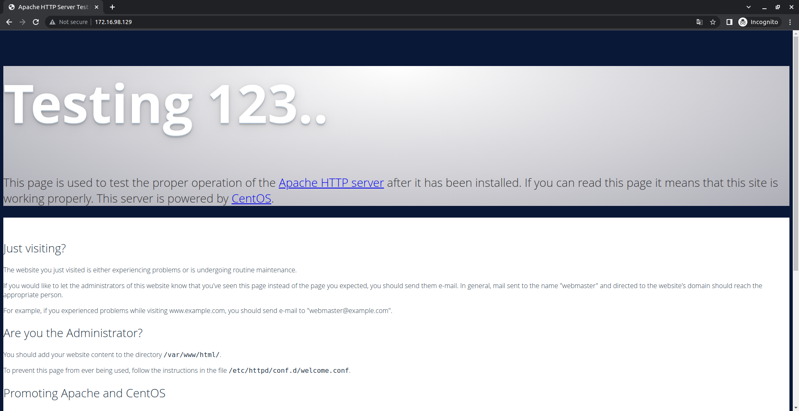
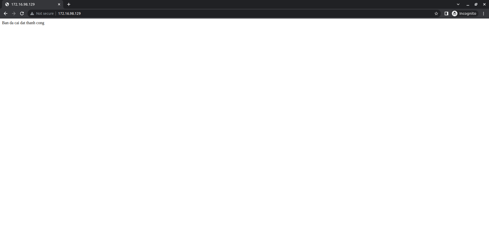
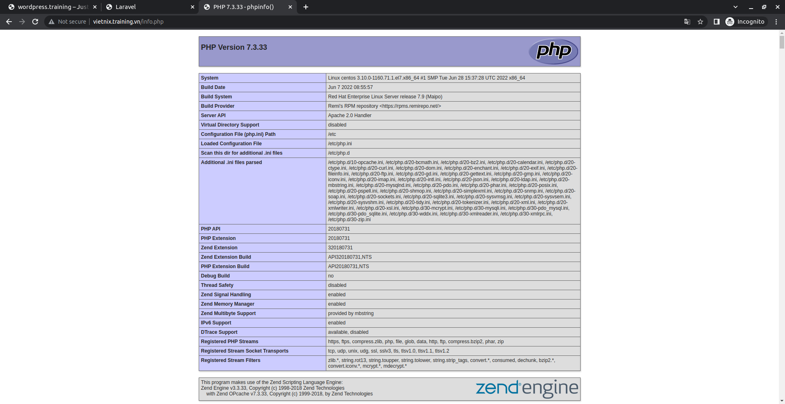
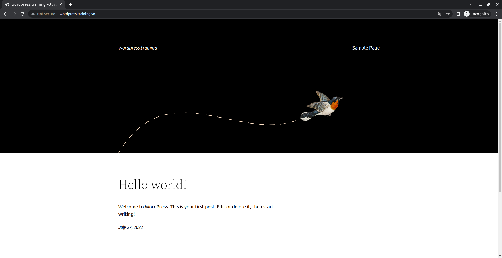
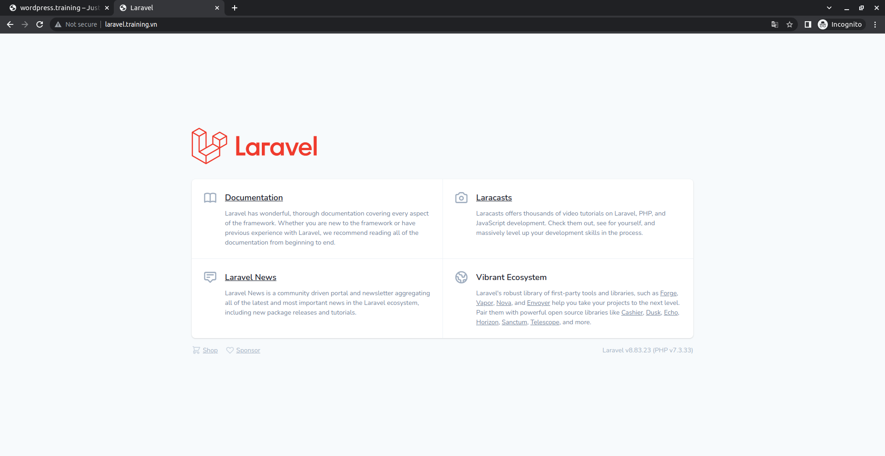

# *~~ MENU FOR TASK 05 ~~*

1. <a href='#1'>Xây dựng reversse proxy kết hợp giữa 2 ứng dụng nginx và apache2
    * Domain: wordpress.training.vn - dựng wordpress
    * Domain: laravel.training.vn - dựng laravel</a>


<div id='1'></div>

# 1.Xây dựng reversse proxy kết hợp giữa 2 ứng dụng nginx và apache2
## Mô hình 


## Cài đặt Apache
```
yum -y update && yum -y install httpd
```
Sau khi cài đặt xong chạy lệnh sau để khởi động Apache Service:
```
systemctl start httpd.service && systemctl enable httpd.service
```
Tiếp theo cấu hình firewall mở port http/https, mặc định trong centos 7 sử dụng FirewallD.
```
firewall-cmd --permanent --zone=public --add-service=http 
firewall-cmd --permanent --zone=public --add-service=https
firewall-cmd --reload
```
Như vậy, ta đã cài đặt Apache web server xong, để kiểm tra Apache hoạt động chưa, mở trình duyệt web truy cập địa chỉ ip của server (http://your-ip-address ) sẽ ra default page của Apache.

> Kết quả


Cấu hình Apache listen ở port 8080 thay vì 80 như mặc định:

```
sed -i '/Listen 80/c\Listen 8080' /etc/httpd/conf/httpd.conf
```
Thay đổi LogFormat, để Apache ghi nhận địa chỉ IP thực của Client từ Nginx Proxy, thay vì địa chỉ IP của nginx. Sửa nội dung directive LogFormat trong tệp tin cấu hình `/etc/httpd/conf/httpd.conf` với nội dung sau:

Đổi dòng:
```
LogFormat "%h %l %u %t \"%r\" %>s %b \"%{Referer}i\" \"%{User-Agent}i\"" combined
```
Thành:
```
LogFormat "%{X-Forwarded-For}i %l %u %t \"%r\" %>s %b \"%{Referer}i\" \"%{User-Agent}i\"" combined
```
Khởi động lại apache:
```
systemctl restart httpd.service
```
## Cài đặt Nginx Reverse proxy
Cài đặt các Repo cần thiết:
```
yum install epel-release -y 
rpm -Uvh http://rpms.famillecollet.com/enterprise/remi-release-7.rpm 
rpm -Uvh http://nginx.org/packages/centos/7/noarch/RPMS/nginx-release-centos-7-0.el7.ngx.noarch.rpm
```
Chạy lệnh sau để cài đặt Nginx:
```
yum install -y nginx
```
Chạy khối lệnh sau để tạo và dán nội dụng cho file proxy_params:
```
cat >/etc/nginx/proxy_config <<EOF
proxy_redirect      off;
proxy_set_header X-Forwarded-Proto \$scheme;
proxy_set_header    Host            \$host;
proxy_set_header    X-Real-IP       \$remote_addr;
proxy_set_header    X-Forwarded-For \$proxy_add_x_forwarded_for;
proxy_pass_header   Set-Cookie;
proxy_connect_timeout   90;
proxy_send_timeout  90;
proxy_read_timeout  90;
proxy_buffers       32 4k;
client_max_body_size 1024m;
client_body_buffer_size 128k;
EOF
```
> Giải thích : 
* `proxy_set_header Host $host`: Dùng để định nghĩa lại trường Host request header mà truyền đến backend khi mà cached được enable trên nginx . $host bằng giá trị server_name trong trường Host request header.
* `proxy_set_header X-Real-IP`: Truyền Real IP của client vào header khi gửi request đến Backend Apache.
* `proxy_set_header X-Forwarded-For`: Mặc định client request thì thông tin sẽ chỉ giao tiếp với reverse proxy, vì vậy mà thông tin log của Backend server (Apache web server) sẽ chỉ nhận được là địa chỉ IP của Nginx proxy. Để ghi nhận địa chỉ IP thực của client vào backend web server, chúng ta sử dụng tham số: “proxy_set_header X-Forwarded-For”
* `proxy_set_header X-Forwarded-Proto`: Xác định giao thức (http hoặc https) mà client gửi request tới proxy.
client_max_body_size: Thiết lập kích thước tối đa mà client sẽ gửi thông tin đến server.

Mở file Virtual host của nginx để cấu hình Proxy (ở đây sử dụng virtual host của trang default): /etc/nginx/conf.d/default.conf. Tại block location / {} chỉnh sửa nội dung để chuyển request từ Proxy về Apache:
## Cấu hình Nginx
Chúng ta sẽ thay đổi cấu hình của file nginx.conf như sau
```
mv /etc/nginx/nginx.conf /etc/nginx/nginx.conf.bak
cd /etc/nginx/
cat >> nginx.conf << EOF
worker_processes 4;
pid /var/run/nginx.pid;
 
events {
        worker_connections 768;
}
 
http {
 
        sendfile on;
        tcp_nopush on;
        tcp_nodelay on;
        keepalive_timeout 65;
        types_hash_max_size 2048;
 
        include /etc/nginx/mime.types;
        default_type application/octet-stream;
 
        access_log /var/log/nginx/access.log;
        error_log /var/log/nginx/error.log;
 
        gzip on;
        gzip_disable "msie6";
        gzip_min_length  1100;
        gzip_buffers  4 32k;
        gzip_types    text/plain application/x-javascript text/xml text/css;
 
        open_file_cache          max=10000 inactive=10m;
        open_file_cache_valid    2m;
        open_file_cache_min_uses 1;
        open_file_cache_errors   on;
 
        ignore_invalid_headers on;
        client_max_body_size    8m;
        client_header_timeout  3m;
        client_body_timeout 3m;
        send_timeout     3m;
        connection_pool_size  256;
        client_header_buffer_size 4k;
        large_client_header_buffers 4 32k;
        request_pool_size  4k;
        output_buffers   4 32k;
        postpone_output  1460;
 
 
        include /etc/nginx/conf.d/*.conf;
        include /etc/nginx/sites-enabled/*;
}
EOF
```
Tạo file Vhost cho nginx, file cấu hình của vhost sẽ được lưu trong đường dẫn /etc/nginx/conf.d/ và /etc/nginx/sites-enabled/
```
cd /etc/nginx/conf.d/
cat >> default.conf << EOF
server {
        listen    80;
        server_name  localhost;
        access_log off;
        error_log  /var/log/httpd/html-error_log crit;
 
location ~* .(gif|jpg|jpeg|png|ico|wmv|3gp|avi|mpg|mpeg|mp4|flv|mp3|mid|js|css|html|htm|wml)$ {
        root /var/www/html;
        expires 30d;
        }
 
location / {
        client_max_body_size    10m;
        client_body_buffer_size 128k;
 
        proxy_send_timeout   90;
        proxy_read_timeout   90;
        proxy_buffer_size    128k;
        proxy_buffers     4 256k;
        proxy_busy_buffers_size 256k;
        proxy_temp_file_write_size 256k;
        proxy_connect_timeout 30s;
 
        proxy_redirect  http://www.example.training.vn:8080   http://www.example.training.vn;
        proxy_redirect  http://example.training.vn:8080   http://example.training.vn;
 
        proxy_pass   http://127.0.0.1:8080/;
 
        proxy_set_header   Host   $host;
        proxy_set_header   X-Real-IP  $remote_addr;
        proxy_set_header   X-Forwarded-For $proxy_add_x_forwarded_for;
        }
}
EOF
```
Copy file Vhost vừa tạo tới thư mục /etc/nginx/sites-available
```
cp /etc/nginx/conf.d/default.conf /etc/nginx/sites-enabled/default.conf 
cp /etc/nginx/sites-available/default.conf /etc/nginx/sites-enabled/default.conf 
```
Start lại service nginx
```
systemctl restart nginx
```
## Cấu hình Apache
Tạo file vhost trong apache

```
cd /etc/httpd/conf.d/
cat >> default.conf << EOF
<VirtualHost *:8080>
ServerAdmin tanlinh@example.training.vn
    DocumentRoot /var/www/html
    ServerName localhost
    ServerAlias localhost
    <Directory "/var/www/html">
               AllowOverride All
               Order allow,deny
               Allow from all
    </Directory>
       RewriteEngine on
    ErrorLog logs/html-error_log
    CustomLog logs/html-access_log common
</VirtualHost>
EOF
```
Tạo thư mục chứa code của website theo file cấu hình ở trên
```
mkdir -p /var/www/html
```
Chúng ta sẽ tạo 1 file index.html trong thư mục /var/www/html/quyenbx.name.vn để kiểm tra việc truy cập website
```
cd /var/www/html/
cat >> index.html << EOF
Ban da cai dat thanh cong
EOF
```
Start lại service httpd
```
systemctl restart httpd
```
> Kết quả:



## Cài đặt php 
Code:
```
yum -y install http://rpms.remirepo.net/enterprise/remi-release-7.rpm
yum -y install epel-release yum-utils
```
Tắt repo PHP 5.4 và khởi động PHP 7.3
```
yum-config-manager --disable remi-php54
yum-config-manager --enable remi-php73
```
Cài đặt thêm các gói :
```
sudo yum -y install php php-cli php-fpm php-mysqlnd php-zip php-devel php-gd php-mcrypt php-mbstring php-curl php-xml php-pear php-bcmath php-json
```
và kiểm tra version
```
php -v
```

Khởi động lại service httpd:
```
systemctl restart httpd
```
Kiểm tra thông tin phiên bản PHP đã cài đặt:
```
vi /var/www/html/info.php
<?php
phpinfo();
?>
```
> Kết quả :



> Ở đây hiển thị `Server API` là `Apache 2.0 Handler` là đã thành công 

## Cài đặt Wordpress cho `wordpress.training.vn`
Download WordPress
Ta có thể download Wordpress trực tiếp từ trang web :
```
wget http://wordpress.org/latest.tar.gz
```
Lệnh này sẽ tải gói wordpress đã nén về thẳng folder chính của user
```
tar -xzvf latest.tar.gz 
```
Tạo Database và User WordPress
```
mysql -u root -p
```
Đăng nhập bằng password root MySQL , sau đó ta cần tạo database wordpress, một user trong database đó và cấp cho user đó một password mới. Lưu ý tất cả các lệnh MySQL phải kết thúc bằng dấu chấm phẩy. Đầu tiên, hãy tạo database
```
CREATE DATABASE wordpress;
Query OK, 1 row affected (0.00 sec)
```
Sau đó, ta cần tạo user mới. :
```
CREATE USER wordpressuser@localhost;
Query OK, 0 rows affected (0.00 sec)
```
Đặt password cho user mới của bạn:
```
SET PASSWORD FOR wordpressuser@localhost= PASSWORD("password");
Query OK, 0 rows affected (0.00 sec)
```
Kết thúc bằng cách cấp tất cả các quyền cho user mới. Nếu không có lệnh này, trình cài đặt wordpress sẽ không thể khởi động:
```
GRANT ALL PRIVILEGES ON wordpress.* TO wordpressuser@localhost IDENTIFIED BY 'password';
Query OK, 0 rows affected (0.00 sec)
```
Sau đó làm mới MySQL:
```
FLUSH PRIVILEGES;
Query OK, 0 rows affected (0.00 sec)
```
Thoát ra khỏi MySQL shell:
```
exit
```
### Cài đặt cấu hình wordpress
Bước đầu tiên là sao chép file cấu hình WordPress mẫu, nằm trong folder WordPress, vào một file mới mà ta sẽ chỉnh sửa, tạo một cấu hình WordPress có thể sử dụng mới:
```
cp ~/wordpress/wp-config-sample.php ~/wordpress/wp-config.php
```
Sau đó mở cấu hình wordpress:
```
sudo nano ~/wordpress/wp-config.php
```
Tìm phần chứa trường bên dưới và thay thế bằng tên chính xác cho database , tên user và password của bạn:
```
// ** MySQL settings - You can get this info from your web host ** //
/** The name of the database for WordPress */
define('DB_NAME', 'wordpress');

/** MySQL database username */
define('DB_USER', 'wordpressuser');

/** MySQL database password */
define('DB_PASSWORD', 'password');
```
Lưu và thoát.

### Sao chép file
Cần tạo folder nơi ta sẽ giữ các file wordpress:
```
sudo mkdir -p /var/www/wordpress
```
Chuyển các file WordPress đã extract vào folder của trang web
```
sudo cp -r ~/wordpress/* /var/www/wordpress.training
```
Cấp quyền sở hữu folder cho user nginx, thay thế "tên user " bằng tên của user server của bạn.
```
cd /var/www/
sudo chown nginx:nginx * -R
sudo usermod -a -G nginx username
```
### Cài đặt file `*.conf` trong nginx cho web `wordpress.training.vn`
``` 
vi /etc/nginx/conf.d/wordpress.training.conf
server {
        listen    80;
        server_name  wordpress.training.vn www.wordpress.training.vn;
        access_log off;
        error_log  /var/log/httpd/wordpress.training.vn-error_log crit;
 
location ~* .(gif|jpg|jpeg|png|ico|wmv|3gp|avi|mpg|mpeg|mp4|flv|mp3|mid|js|css|html|htm|wml)$ {
        root /var/www/wordpress.training;
        expires 30d;
        }
 
location / {
        client_max_body_size    10m;
        client_body_buffer_size 128k;
 
        proxy_send_timeout   90;
        proxy_read_timeout   90;
        proxy_buffer_size    128k;
        proxy_buffers     4 256k;
        proxy_busy_buffers_size 256k;
        proxy_temp_file_write_size 256k;
        proxy_connect_timeout 30s;
 
        proxy_redirect  http://www.wordpress.training.vn:8080   http://www.wordpress.training.vn;
        proxy_redirect  http://wordpress.training.vn:8080   http://wordpress.training.vn;
 
        proxy_pass   http://127.0.0.1:8080/;
 
        proxy_set_header   Host   $host;
        proxy_set_header   X-Real-IP  $remote_addr;
        proxy_set_header   X-Forwarded-For $proxy_add_x_forwarded_for;
        }
}

```
Copy file `*.conf` vừa tạo vào folder `site-enable` và `site-available`
```
cp /etc/nginx/conf.d/laravel.training.vn.conf /etc/nginx/sites-enabled/laravel.training.vn.conf
cp /etc/nginx/conf.d/laravel.training.vn.conf /etc/nginx/sites-available/laravel.training.vn.conf 
```
Start lại service nginx
```
systemctl restart nginx
```
### Cài đặt file `*.conf` trong `apache` cho web `wordpress.training.vn`
```
vi /etc/httpd/conf.d/wordpress.training
<VirtualHost *:8080>
ServerAdmin tanlinh@wordpress.training.vn
    DocumentRoot /var/www/wordpress.training
    ServerName wordpress.training.vn
    ServerAlias www.wordpress.training.vn
    <Directory "/var/www/wordpress.training">
               AllowOverride All
               Order allow,deny
               Allow from all
    </Directory>
       RewriteEngine on
    ErrorLog logs/wordpress.training-error_log
    CustomLog logs/wordpress.training-access_log common
</VirtualHost>
```
Khởi động lại `apache`
```
systemctl restart httpd
```
## Kiểm tra kết quả 
> Kết quả :



## Caì đặt Laravel cho `laravel.training.vn`
Tương tự với web `wordpress.training.vn` ta thiết lập file `*conf` ở `nginx` cho nó
```
vi /etc/nginx/conf.d/laravel.training.conf
server {
        listen    80;
        server_name  laravel.training.vn www.laravel.training.vn;
        access_log off;
        error_log  /var/log/httpd/laravel.training.vn-error_log crit;
 
location ~* .(gif|jpg|jpeg|png|ico|wmv|3gp|avi|mpg|mpeg|mp4|flv|mp3|mid|js|css|html|htm|wml)$ {
        root /var/www/laravel.training;
        expires 30d;
        }
 
location / {
        client_max_body_size    10m;
        client_body_buffer_size 128k;
 
        proxy_send_timeout   90;
        proxy_read_timeout   90;
        proxy_buffer_size    128k;
        proxy_buffers     4 256k;
        proxy_busy_buffers_size 256k;
        proxy_temp_file_write_size 256k;
        proxy_connect_timeout 30s;
 
        proxy_redirect  http://www.laravel.training.vn:8080   http://www.laravel.training.vn;
        proxy_redirect  http://laravel.training.vn:8080   http://laravel.training.vn;
 
        proxy_pass   http://127.0.0.1:8080/;
 
        proxy_set_header   Host   $host;
        proxy_set_header   X-Real-IP  $remote_addr;
        proxy_set_header   X-Forwarded-For $proxy_add_x_forwarded_for;
        }
}
```

Copy file *.conf vừa tạo vào folder site-enable và site-available
```
cp /etc/nginx/conf.d/laravel.training.vn.conf /etc/nginx/sites-enabled/laravel.training.vn.conf
cp /etc/nginx/conf.d/laravel.training.vn.conf /etc/nginx/sites-available/laravel.training.vn.conf 
```
Start lại service nginx
```
systemctl restart nginx
```
## Cài đặt file `*.conf` trong `apache` cho web `laravel.training.vn`
```
<VirtualHost *:8080>
ServerAdmin tanlinh@laravel.training.vn
    DocumentRoot /var/www/laravel.training/public
    ServerName laravel.training.vn
    ServerAlias www.laravel.training.vn
    <Directory "/var/www/laravel.training/public">
               AllowOverride All
               Order allow,deny
               Allow from all
    </Directory>
       RewriteEngine on
    ErrorLog logs/laravel.training-error_log
    CustomLog logs/laravel.training-access_log common
</VirtualHost>
```
Khởi động lại apache
```
systemctl restart httpd
```
## Kiểm tra kết quả 
> Kết quả:


### Cho phép truy cập port 80, 443, 3306, 22
```
iptables -I INPUT 1 -p tcp -m tcp –dport 80 -j ACCEPT
iptables -I INPUT 1 -p tcp -m tcp –dport 443 -j ACCEPT
iptables -I INPUT 1 -p tcp -m tcp –dport 3306 -j ACCEPT
iptables -I INPUT 1 -p tcp -m tcp –dport 22 -j ACCEPT
```

