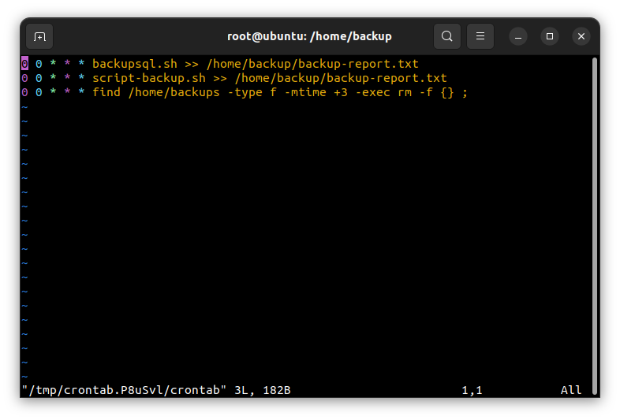

# *~~ MENU FOR TASK 06 ~~*

1. <a href='#1'>Viết script backup mysql chạy backup </a>
1. <a href='#2'>Mỗi ngày đều backup, lưu trữ file backup tại /home/backup và giữ lại 3 bản gần nhất bằng cronjob</a>

<div id='1'></div>

# 1.Script backup mysql chạy backup 
# 1.1 Backup 1 database
- Chúng ta cần tạo 1 file script trong `/bin`
```
vi /bin/script-backup.sh

#! /bin/sh
#
ngay=$(date +"%T %d-%m-%Y")
file_name="backup-$ngay"
echo
mysqldump --single-transaction --routines --triggers --add-drop-table --extended-insert -u <user> -p<password> <tên database> | gzip -9 > /home/backup/DBbackup_$(date +"%T %d-%m-%Y").sql.gz
echo 
echo "BACKUP CSDL THANH CONG VAO LUC $ngay!" 
echo zip -r /home/backup/$file_name cd /home -x "*backup*" > /dev/null
echo "Ten file CSDL backup: $file_name.sql.gz" 
echo 
```
> Kết quả: 

 


<div id='2'></div>

# 1.2 Backup tất cả các database
Tạo 1 file `script` trong `/bin`
```
vi /bin/backupsql.sh

#!/bin/bash
# Simple script to backup MySQL databases

# Parent backup directory
backup_parent_dir="/home/backup"

# MySQL settings
mysql_user="root"
mysql_password="82810722"

# Read MySQL password from stdin if empty
if [ -z "${mysql_password}" ]; then
  echo -n "Enter MySQL ${mysql_user} password: "
  read -s mysql_password
  echo
fi

# Check MySQL password
echo exit | mysql --user=${mysql_user} --password=${mysql_password} -B 2>/dev/null
if [ "$?" -gt 0 ]; then
  echo "MySQL ${mysql_user} password incorrect"
  exit 1
else
  echo "MySQL ${mysql_user} password correct."
fi

# Create backup directory and set permissions
backup_date=`date +%T-%d-%m-%Y`
backup_dir="${backup_parent_dir}/${backup_date}"
echo "Backup directory: ${backup_dir}"
mkdir -p "${backup_dir}"
chmod 700 "${backup_dir}"

# Get MySQL databases
mysql_databases=`echo 'show databases' | mysql --user=${mysql_user} --password=${mysql_password} -B | sed /^Database$/d`

# Backup and compress each database
for database in $mysql_databases
do
  if [ "${database}" == "information_schema" ] || [ "${database}" == "performance_schema" ]; then
        additional_mysqldump_params="--skip-lock-tables"
  else
        additional_mysqldump_params=""
  fi
  echo "Creating backup of \"${database}\" database"
  mysqldump ${additional_mysqldump_params} --user=${mysql_user} --password=${mysql_password} ${database} | gzip > "${backup_dir}/${database}.gz"
  chmod 600 "${backup_dir}/${database}.gz"
done
```
Cần phân quyền 777 cho script 
```
chmod 777 /bin/backupsql.sh
```
> Notes:
- Tại dòng : backup_parent_dir="/home/backup (là đường dẫn lưu trữ các file backup database , bạn có thể chỉnh lại đường dẫn tùy ý)
- mysql_user="root"   (là tài khoản root của MySQL)
- mysql_password="password"   (điền password cụ thể)
- Sau khi chỉnh sửa xong , tiến hành save lại
>Kết quả:

# 2.Tạo lệnh backup mỗi ngày và giữ lại 3 bản mới nhất bằng cronjob
Để thêm cronjob ta dùng lệnh
```
crontab -e
```
```
0 0 * * * backupsql.sh >> /home/backup/backup-report.txt #Tự động backup tất cả database vào 00:00 mỗi ngày
0 0 * * * script-backup.sh >> /home/backup/backup-report.txt #Tự động backup database vào 00:00 mỗi ngày
0 0 * * * find /home/backups -type f -mtime +3 -exec rm -f {} ; #Tự động tìm và xoá các file backup quá 3 ngày vào lúc 00:00 mỗi ngày
```

