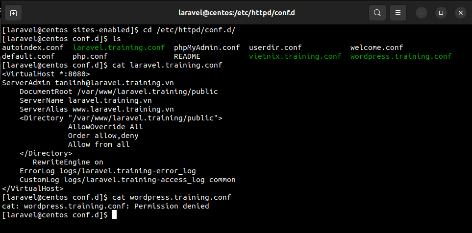

# *~~ MENU FOR TASK 07 ~~*

1. <a href='#1'>Trên máy ảo centos 6 hoặc 7 đã cài đặt, tiến hành cài đặt mô hình :
- Tạo 2 user wordpress, laravel
Domain: wordpress.training.vn - dựng wordpress - phải chạy bằng user wordpress
Domain: laravel.training.vn - dựng laravel - phải chạy bàng user laravel
+ reverse proxy,
+ mysql,
+ phpmyadmin</a>


<div id='1'></div>

# 1. Cấu hình Reverse Proxy cho 2 domain wordpress.training.vn và laravel.training.vn
## Cài đặt apache(port 8080), nginx, php, mariadb
## 1.1 Cài đặt Wordpress cho wordpress.training.vn
Download WordPress
Ta có thể download Wordpress trực tiếp từ trang web :
```
wget http://wordpress.org/latest.tar.gz
```
Lệnh này sẽ tải gói wordpress đã nén về thẳng folder chính của user
```
tar -xzvf latest.tar.gz 
```
Tạo Database và User WordPress
```
mysql -u root -p
```
Đăng nhập bằng password root MySQL , sau đó ta cần tạo database wordpress, một user trong database đó và cấp cho user đó một password mới. Lưu ý tất cả các lệnh MySQL phải kết thúc bằng dấu chấm phẩy. Đầu tiên, hãy tạo database
```
CREATE DATABASE wordpress;
Query OK, 1 row affected (0.00 sec)
```
Sau đó, ta cần tạo user mới. :
```
CREATE USER wordpressuser@localhost;
Query OK, 0 rows affected (0.00 sec)
```
Đặt password cho user mới của bạn:
```
SET PASSWORD FOR wordpressuser@localhost= PASSWORD("password");
Query OK, 0 rows affected (0.00 sec)
```
Kết thúc bằng cách cấp tất cả các quyền cho user mới. Nếu không có lệnh này, trình cài đặt wordpress sẽ không thể khởi động:
```
GRANT ALL PRIVILEGES ON wordpress.* TO wordpressuser@localhost IDENTIFIED BY 'password';
Query OK, 0 rows affected (0.00 sec)
```
Sau đó làm mới MySQL:
```
FLUSH PRIVILEGES;
Query OK, 0 rows affected (0.00 sec)
```
Thoát ra khỏi MySQL shell:
```
exit
```
### Cài đặt cấu hình wordpress
Bước đầu tiên là sao chép file cấu hình WordPress mẫu, nằm trong folder WordPress, vào một file mới mà ta sẽ chỉnh sửa, tạo một cấu hình WordPress có thể sử dụng mới:
```
cp ~/wordpress/wp-config-sample.php ~/wordpress/wp-config.php
```
Sau đó mở cấu hình wordpress:
```
sudo nano ~/wordpress/wp-config.php
```
Tìm phần chứa trường bên dưới và thay thế bằng tên chính xác cho database , tên user và password của bạn:
```
// ** MySQL settings - You can get this info from your web host ** //
/** The name of the database for WordPress */
define('DB_NAME', 'wordpress');

/** MySQL database username */
define('DB_USER', 'wordpressuser');

/** MySQL database password */
define('DB_PASSWORD', 'password');
```
Lưu và thoát.

### Sao chép file
Cần tạo folder nơi ta sẽ giữ các file wordpress:
```
sudo mkdir -p /var/www/wordpress
```
Chuyển các file WordPress đã extract vào folder của trang web
```
sudo cp -r ~/wordpress/* /var/www/wordpress.training
```
Cấp quyền sở hữu folder cho user nginx, thay thế "tên user " bằng tên của user server của bạn.
```
cd /var/www/
sudo chown nginx:nginx * -R
sudo usermod -a -G nginx username
```
### Cài đặt file `*.conf` trong nginx cho web `wordpress.training.vn`
``` 
vi /etc/nginx/conf.d/wordpress.training.conf
server {
        listen    80;
        server_name  wordpress.training.vn www.wordpress.training.vn;
        access_log off;
        error_log  /var/log/httpd/wordpress.training.vn-error_log crit;
 
location ~* .(gif|jpg|jpeg|png|ico|wmv|3gp|avi|mpg|mpeg|mp4|flv|mp3|mid|js|css|html|htm|wml)$ {
        root /var/www/wordpress.training;
        expires 30d;
        }
 
location / {
        client_max_body_size    10m;
        client_body_buffer_size 128k;
 
        proxy_send_timeout   90;
        proxy_read_timeout   90;
        proxy_buffer_size    128k;
        proxy_buffers     4 256k;
        proxy_busy_buffers_size 256k;
        proxy_temp_file_write_size 256k;
        proxy_connect_timeout 30s;
 
        proxy_pass   http://127.0.0.1:8080/;
 
        proxy_set_header   Host   $host;
        proxy_set_header   X-Real-IP  $remote_addr;
        proxy_set_header   X-Forwarded-For $proxy_add_x_forwarded_for;
        }
}

```
Copy file `*.conf` vừa tạo vào folder `site-enable` và `site-available`
```
cp /etc/nginx/conf.d/laravel.training.vn.conf /etc/nginx/sites-enabled/laravel.training.vn.conf
cp /etc/nginx/conf.d/laravel.training.vn.conf /etc/nginx/sites-available/laravel.training.vn.conf 
```
Start lại service nginx
```
systemctl restart nginx
```
### Cài đặt file `*.conf` trong `apache` cho web `wordpress.training.vn`
```
vi /etc/httpd/conf.d/wordpress.training
<VirtualHost *:8080>
ServerAdmin tanlinh@wordpress.training.vn
    DocumentRoot /var/www/wordpress.training
    ServerName wordpress.training.vn
    ServerAlias www.wordpress.training.vn
    <Directory "/var/www/wordpress.training">
               AllowOverride All
               Order allow,deny
               Allow from all
    </Directory>
       RewriteEngine on
    ErrorLog logs/wordpress.training-error_log
    CustomLog logs/wordpress.training-access_log common
</VirtualHost>
```
Khởi động lại `apache`
```
systemctl restart httpd
```
## 1.2 Tạo user `wordpress` và cấp quyền truy cập các file `conf` và `source code`
Tạo user :
```
useradd wordpress
```
đặt `password`
```
passwd wordpress
```
cấp quyền truy cập các file `conf` và `source code` 
```
chown -R apache:wordpress /var/www/wordpress.training
chmod -R 770 /var/www/wordpress.training
chown -R apache:wordpress /ect/nginx/site-enable/wordpress.training.conf
chmod -R 770 /etc/nginx/site-enable/wordpress.training.conf
chown -R apache:wordpress /ect/httpd/conf.d/wordpress.training.conf
chmod -R 770 /etc/httpd/conf.d/wordpress.training.conf
```
> Kết quả:


## 1.3 Caì đặt Laravel cho `laravel.training.vn`
Tương tự với web `wordpress.training.vn` ta thiết lập file `*conf` ở `nginx` cho nó
```
vi /etc/nginx/conf.d/laravel.training.conf
server {
        listen    80;
        server_name  laravel.training.vn www.laravel.training.vn;
        access_log off;
        error_log  /var/log/httpd/laravel.training.vn-error_log crit;
 
location ~* .(gif|jpg|jpeg|png|ico|wmv|3gp|avi|mpg|mpeg|mp4|flv|mp3|mid|js|css|html|htm|wml)$ {
        root /var/www/laravel.training;
        expires 30d;
        }
 
location / {
        client_max_body_size    10m;
        client_body_buffer_size 128k;
 
        proxy_send_timeout   90;
        proxy_read_timeout   90;
        proxy_buffer_size    128k;
        proxy_buffers     4 256k;
        proxy_busy_buffers_size 256k;
        proxy_temp_file_write_size 256k;
        proxy_connect_timeout 30s;
 
        proxy_pass   http://127.0.0.1:8080/;
 
        proxy_set_header   Host   $host;
        proxy_set_header   X-Real-IP  $remote_addr;
        proxy_set_header   X-Forwarded-For $proxy_add_x_forwarded_for;
        }
}
```

Copy file *.conf vừa tạo vào folder site-enable và site-available
```
cp /etc/nginx/conf.d/laravel.training.vn.conf /etc/nginx/sites-enabled/laravel.training.vn.conf
cp /etc/nginx/conf.d/laravel.training.vn.conf /etc/nginx/sites-available/laravel.training.vn.conf 
```
Start lại service nginx
```
systemctl restart nginx
```
## Cài đặt file `*.conf` trong `apache` cho web `laravel.training.vn`
```
<VirtualHost *:8080>
ServerAdmin tanlinh@laravel.training.vn
    DocumentRoot /var/www/laravel.training/public
    ServerName laravel.training.vn
    ServerAlias www.laravel.training.vn
    <Directory "/var/www/laravel.training/public">
               AllowOverride All
               Order allow,deny
               Allow from all
    </Directory>
       RewriteEngine on
    ErrorLog logs/laravel.training-error_log
    CustomLog logs/laravel.training-access_log common
</VirtualHost>
```
Khởi động lại apache
```
systemctl restart httpd
```
## 1.4 Tạo user `laravel` và cấp quyền truy cập các file `conf` và `source code`
Tạo user :
```
useradd laravel
```
đặt `password`
```
passwd wordpress
```
cấp quyền truy cập các file `conf` và `source code` 
```
chown -R apache:laravel /var/www/laravel.training
chmod -R 770 /var/www/laravel.training
chown -R apache:laravel /ect/nginx/site-enable/laravel.training.conf
chmod -R 770 /etc/nginx/site-enable/laravel.training.conf
chown -R apache:laravel /ect/httpd/conf.d/laravel.training.conf
chmod -R 770 /etc/httpd/conf.d/laravel.training.conf
```
> Kết quả:


